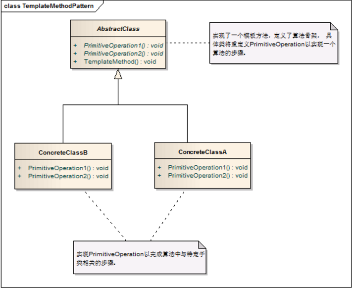
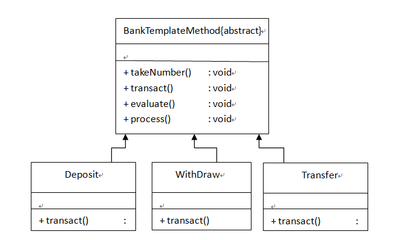

## 模板设计模式

参考：https://www.cnblogs.com/qq-361807535/p/6854191.html

引入：这几天在看一本讲spring源码的书《SPRING技术内幕》里面在讲加载配置文件的时候，可以有不同的加载方式，如根据文件系统目录加载配置文件（FileSystemXmlApplicationContext），类路径加载配置文件(ClassPathXmlApplicationContext)，以及根据项目上下文目录(XmlWebApplicationContext)加载配置文件。这个在加载的过程中就使用了模板设计模式，所以就来学习下模板设计模式。

### 1. 模板设计模式在书中定义：

　 定义一个操作中算法的骨架，而将一些步骤延迟到子类中，模板方法使得子类可以不改变算法的结构即可重定义该算法的某些特定步骤。

　 通俗点的理解就是 ：完成一件事情，有固定的数个步骤，但是每个步骤根据对象的不同，而实现细节不同；就可以在父类中定义一个完成该事情的总方法，按照完成事件需要的步骤去调用其每个步骤的实现方法。每个步骤的具体实现，由子类完成。

### 2. 如下网上找到的一个模板模式的类图：

　　抽象父类（AbstractClass）：实现了模板方法，定义了算法的骨架。

　　具体类（ConcreteClass)：实现抽象类中的抽象方法，即不同的对象的具体实现细节。

​    

### 3. 实例说明

　 来举个例子： 比如我们做菜可以分为三个步骤 （1）备料 （2）具体做菜 （3）盛菜端给客人享用，这三部就是算法的骨架 ；然而做不同菜需要的料，做的方法，以及如何盛装给客人享用都是不同的这个就是不同的实现细节。

  下来我们就代码实现如下

　a. 先来写一个抽象的做菜父类：  

```
public abstract class DodishTemplate {    
    /**
     * 具体的整个过程
     */
    protected void dodish(){
        this.preparation();
        this.doing();
        this.carriedDishes();
    }
    /**
     * 备料
     */
    public abstract void preparation();
    /**
     * 做菜
     */
    public abstract void doing();
    /**
     * 上菜
     */
    public abstract void carriedDishes ();
}
```

　b. 下来做两个番茄炒蛋（EggsWithTomato）和红烧肉（Bouilli）实现父类中的抽象方法

```
/**
 * 西红柿炒蛋
 * @author aries
 */
public class EggsWithTomato extends DodishTemplate{

    @Override
    public void preparation() {
        System.out.println("洗并切西红柿，打鸡蛋。");
    }

    @Override
    public void doing() {
        System.out.println("鸡蛋倒入锅里，然后倒入西红柿一起炒。");
    }

    @Override
    public void carriedDishes() {
        System.out.println("将炒好的西红寺鸡蛋装入碟子里，端给客人吃。");
    }

}
```

```
/**
 * 红烧肉
 * @author aries
 *
 */
public class Bouilli extends DodishTemplate{

    @Override
    public void preparation() {
        System.out.println("切猪肉和土豆。");
    }

    @Override
    public void doing() {
        System.out.println("将切好的猪肉倒入锅中炒一会然后倒入土豆连炒带炖。");
    }

    @Override
    public void carriedDishes() {
        System.out.println("将做好的红烧肉盛进碗里端给客人吃。");
    }

}
```

  c. 在测试类中我们来做菜：

```
public class App {
    public static void main(String[] args) {
        DodishTemplate eggsWithTomato = new EggsWithTomato();
        eggsWithTomato.dodish();
        
        System.out.println("-----------------------------");
        
        DodishTemplate bouilli = new Bouilli();
        bouilli.dodish();
    }
}
```

 这样我们就实现了使用模板模式的一个完整的实例。

### 4. 在书本上看到过这么一个例子：

　去银行办业务，如取钱，存钱或者办卡等，基本都需要三个大的步骤（骨架），首先 （1）取号 （2）办具体业务 （3）服务评价打分，然后这三个步骤就可以抽取到父类中进行定义，（1）取号 （3）服务打分是相同操作，可以直接在父类总实现，然后（2）办具体的业务各不相同需要在子类中实现。如下我画个类图：



​    takeNumber(取号)，trabsact(具体业务)，evaluate(评价)，process(骨架方法)。

### 5. 模板设计模式常在数据库操作中使用，我现在使用模板模式做一个JDBC的查询模板：

  (1) 抽象查询父类 

```
public abstract class AbstractDao {

    /**
     * 查询
     * @param sql
     * @param params
     * @return
     */
    protected Object find(String sql, Object[] params) {
        Connection conn = null;
        PreparedStatement ps = null;
        ResultSet rs = null;
        Object obj = null;
        try {
            conn = JDBCUtils.getConnection();
            ps = conn.prepareStatement(sql);
            for (int i = 0; i < params.length; i++) {
                ps.setObject(i + 1, params[i]);
            }
            rs = ps.executeQuery();
            while (rs.next()) {
                obj = rowMapper(rs);
            }
        } catch (Exception e) {
            e.printStackTrace();
        } finally {
            JDBCUtils.free(rs, ps, conn);
        }
        return obj;
    }
    
    protected abstract Object rowMapper(ResultSet rs) throws SQLException;
    
    //同时可以添加 insert ，update 等方法
}
```

 （2）具体的UserDao

```
/**
 * userDao
 * 
 * @author aries
 *
 */
public class UserDao extends AbstractDao {

    public User findUser(int userId) {
        String sql = "select * from t_user where userId = ?";
        Object[] params = new Object[] { userId };
        Object user = super.find(sql, params);
        System.out.println((User) user);
        return (User) user;
    }

    @Override
    protected Object rowMapper(ResultSet rs) throws SQLException {
        User user = new User();
        user.setId(rs.getInt("userId"));
        user.setName(rs.getString("name"));
        user.setAge(rs.getInt("age"));
        user.setSex(rs.getString("sex"));
        user.setAddress(rs.getString("address"));
        return user;
    }
}
```

 （3）以上代码中用到的User类和JDBCUtil

```
public class JDBCUtils {
    private static String url = "jdbc:mysql://localhost:3306/jdbcstudy";
    private static String user = "root";
    private static String password = "123";

    private JDBCUtils() {
    }

    static {
        try {
            Class.forName("com.mysql.jdbc.Driver");
        } catch (ClassNotFoundException e) {
            throw new ExceptionInInitializerError(e);
        }
    }

    public static Connection getConnection() throws SQLException {
        return DriverManager.getConnection(url, user, password);
    }
    
    public static void free(ResultSet rs, PreparedStatement ps, Connection conn){
        if(rs != null){
            try {
                rs.close();
            } catch (SQLException e) {
                e.printStackTrace();
            }
        }
        if(ps != null){
            try {
                ps.close();
            } catch (SQLException e) {
                e.printStackTrace();
            }
        }
        
        if(conn != null){
            try {
                conn.close();
            } catch (SQLException e) {
                e.printStackTrace();
            }
        }
    }
}
```

```
/**
 * 用户类
 * 
 * @author aries
 *
 */
public class User {
    private Integer id;
    private String name;
    private Integer age;
    private String sex;
    private String address;
        
    //set...get省略    
}
```

 如上就使用模板模式做的查询，父类中做了算法骨架，子类中具体实现算法中的不同部分。

### 6. 模板模式的优点

　（1）具体细节步骤实现定义在子类中，子类定义详细处理算法是不会改变算法整体结构。

　（2）代码复用的基本技术，在数据库设计中尤为重要。

　（3）存在一种反向的控制结构，通过一个父类调用其子类的操作，通过子类对父类进行扩展增加新的行为，符合“开闭原则”。

### 7. 不足

​    每个不同的实现都需要定义一个子类，会导致类的个数增加，系统更加庞大。