## TreeMap源码

[TOC]

### 一、基本结构

节点结构

```java
static final class Entry<K,V> implements Map.Entry<K,V> {
    K key;
    V value;
    Entry<K,V> left;
    Entry<K,V> right;
    Entry<K,V> parent;
    boolean color = BLACK;// black为true
    Entry(K key, V value, Entry<K,V> parent) {
        this.key = key;
        this.value = value;
        this.parent = parent;
    }
    public K getKey() {
        return key;
    }
    public V getValue() {
        return value;
    }
    public V setValue(V value) {
        V oldValue = this.value;
        this.value = value;
        return oldValue;
    }
    public boolean equals(Object o) {//同时比较key value
        if (!(o instanceof Map.Entry))
            return false;
        Map.Entry<?,?> e = (Map.Entry<?,?>)o;
        return valEquals(key,e.getKey()) && valEquals(value,e.getValue());
    }
    public int hashCode() {//同时用到了key和value的哈希的异或
        int keyHash = (key==null ? 0 : key.hashCode());
        int valueHash = (value==null ? 0 : value.hashCode());
        return keyHash ^ valueHash;//异或,不同为1
    }
    public String toString() { return key + "=" + value; }
}
```

基本属性：

```java
	private final Comparator<? super K> comparator;//比较器
    private transient Entry<K,V> root;   //根节点
	private transient int size = 0;     //节点数量
	private transient int modCount = 0; //结构修改的次数
```

构造函数：

```java
public TreeMap() {
    comparator = null;
}
public TreeMap(Comparator<? super K> comparator) {
    this.comparator = comparator;
}
/**Constructs a new tree map containing the same mappings as the given
 * map, ordered according to the <em>natural ordering</em> of its keys.
 * All keys inserted into the new map must implement the {@link
 * Comparable} interface.  Furthermore, all such keys must be
 * <em>mutually comparable</em>: {@code k1.compareTo(k2)} must not throw
 * a {@code ClassCastException} for any keys {@code k1} and
 * {@code k2} in the map.  This method runs in n*log(n) time.
 * @param  m the map whose mappings are to be placed in this map
 * @throws ClassCastException if the keys in m are not {@link Comparable},
 *         or are not mutually comparable
 * @throws NullPointerException if the specified map is null*/
public TreeMap(Map<? extends K, ? extends V> m) {
    comparator = null;
    putAll(m);
}
/**Constructs a new tree map containing the same mappings and
 * using the same ordering as the specified sorted map.  This
 * method runs in linear time.
 * @param  m the sorted map whose mappings are to be placed in this map,
 *         and whose comparator is to be used to sort this map
 * @throws NullPointerException if the specified map is null */
public TreeMap(SortedMap<K, ? extends V> m) {
    comparator = m.comparator();
    try {
        buildFromSorted(m.size(), m.entrySet().iterator(), null, null);
    } catch (java.io.IOException cannotHappen) {
    } catch (ClassNotFoundException cannotHappen) {
    }
}
```

插入:如果已经有key，则替代并返回oldValue。

```java
/**@return the previous value associated with {@code key}, or {@code null} if there was no mapping for {@code key}. (A {@code null} return can also indicate that the map previously associated {@code null} with {@code key}.)
 * @throws ClassCastException if the specified key cannot be compared with the keys in  map
 * @throws NullPointerException if the specified key is null */
public V put(K key, V value) {
    Entry<K,V> t = root;
    if (t == null) {    //如果为空，则添加为根节点
        compare(key, key); // type (and possibly null) check
        root = new Entry<>(key, value, null);
        size = 1;
        modCount++;
        return null;
    }
    int cmp;
    Entry<K,V> parent;
    // split comparator and comparable paths
    Comparator<? super K> cpr = comparator;
    if (cpr != null) { //1.使用指定的比较器
        do {
            parent = t;
            cmp = cpr.compare(key, t.key);
            if (cmp < 0)
                t = t.left;
            else if (cmp > 0)
                t = t.right;
            else
                return t.setValue(value); //如果找到key相等的，则设置新值并返回
        } while (t != null);
    }
    else { //1.使用默认的比较器
        if (key == null) throw new NullPointerException();//key 不能为null
        @SuppressWarnings("unchecked")
            Comparable<? super K> k = (Comparable<? super K>) key;
        do {
            parent = t;
            cmp = k.compareTo(t.key);
            if (cmp < 0)
                t = t.left;
            else if (cmp > 0)
                t = t.right;
            else
                return t.setValue(value);
        } while (t != null);
    }
    //此时，说明没有key相等的，需要在叶子节点parent后添加
    Entry<K,V> e = new Entry<>(key, value, parent);//节点指向叶子节点parent
    if (cmp < 0) //左孩子
        parent.left = e;
    else         //右孩子
        parent.right = e;
    fixAfterInsertion(e);  //从e开始向上调整。
    size++;      //计数+1
    modCount++;  //结构修改+1
    return null;
}
```

一些辅助操作，包括null检查：

```java
//返回节点颜色，null为black
private static <K,V> boolean colorOf(Entry<K,V> p) {
    return (p == null ? BLACK : p.color);
}
//返回父亲节点
private static <K,V> Entry<K,V> parentOf(Entry<K,V> p) {
    return (p == null ? null: p.parent);
}
//设置颜色
private static <K,V> void setColor(Entry<K,V> p, boolean c) {
    if (p != null)
        p.color = c;
}
//左孩子
private static <K,V> Entry<K,V> leftOf(Entry<K,V> p) {
    return (p == null) ? null: p.left;
}
//右孩子
private static <K,V> Entry<K,V> rightOf(Entry<K,V> p) {
    return (p == null) ? null: p.right;
}
```


### 二、红黑树的插入操作

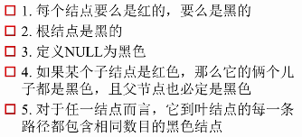 

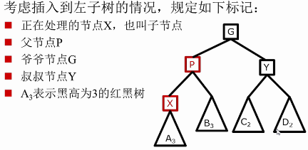


调整策略：自底向上，直到根节点或平衡。在调整p节点之前，要让p的左右子树都为RBT。

插入调整策略：

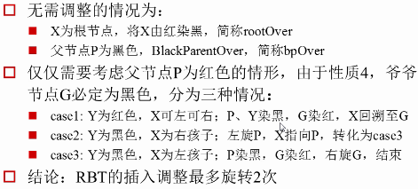

先只考虑父亲P为G的左孩子，右孩子对称。

case 1：

- 条件：**叔叔Y为红色，X可左可右**
- 处理方式：父亲、叔叔、爷爷的颜色取反。将引用回溯至爷爷。
- 进过调整之后：
  - 满足了：不能有连续的红节点。
  - X,G的黑高未改变。
  - P,Y的黑高同时+1
  - 可能不满足：因为G是红色的，可能不满足根为黑，不能连续红。需要继续调整。因为G是红色的，所以case1可能继续转为case1, case2, case3。
  - 如果G为根节点，此时将G染黑，算法结束。**这是唯一地增加整个黑高的情况**。

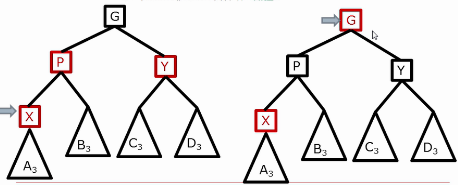

```java
// 1. 父节点是左孩子
    if (parentOf(x) == leftOf(parentOf(parentOf(x)))) {//父节点 是 爷节点 的左孩子
        Entry<K,V> y = rightOf(parentOf(parentOf(x))); //取得叔叔节点y, 爷的右孩子
        // 1.1 叔叔节点为红色：将父亲、叔叔、爷爷的颜色取反，为黑、黑、红
        if (colorOf(y) == RED) {
            setColor(parentOf(x), BLACK);
            setColor(y, BLACK);
            setColor(parentOf(parentOf(x)), RED);
            x = parentOf(parentOf(x)); //将x的引用设置为爷爷节点
        }
```

case 2：

- 条件：**叔叔Y为黑色，X为右孩子**。
- 处理方式：X指向父亲P，再左旋，,转为case3。（子变父，左旋）
- 调整之后：
  - P,X,G的左右子树的BH未改变，即不会引起BH的变化
  - 但px为连续红，需要继续调整

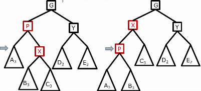

```java
		 else {// 1.2 叔叔为黑色
                if (x == rightOf(parentOf(x))) { // 若x为右孩子
                    x = parentOf(x);//x指向父亲
                    rotateLeft(x);  //左旋
                }
```

case 3：

- 条件：**叔叔Y为黑色，X为左孩子**。
- 处理方式：父亲P涂黑，爷爷G染红，右旋爷爷G，结束。
- 调整之后：BH未改变，P为最上面的节点，为黑色。算法结束。

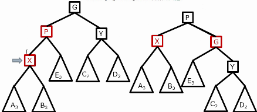

```java
			   // 1.2.2若x为左孩子
                setColor(parentOf(x), BLACK);        //父染黑
                setColor(parentOf(parentOf(x)), RED);//爷染红
                rotateRight(parentOf(parentOf(x)));  //右旋爷
```

 总体case：

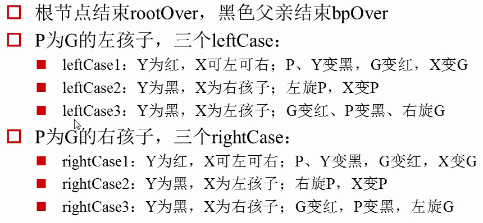

向上调整全部代码：

```java
private void fixAfterInsertion(Entry<K,V> x) {
    x.color = RED;//插入节点设置为红色
    // 如果是根节点，或者父节点是黑色，则不需要调整。
    // 如果 x非空 && 不是根 && 父节点为红，则需要调整
    while (x != null && x != root && x.parent.color == RED) {
        // 1. 父节点是左孩子
        if (parentOf(x) == leftOf(parentOf(parentOf(x)))) {//父节点 是 爷节点 的左孩子
            Entry<K,V> y = rightOf(parentOf(parentOf(x))); //取得叔叔节点y, 爷的右孩子
            // 1.1 case1 叔叔节点为红色：将父亲、叔叔、爷爷的颜色取反，为黑、黑、红
            if (colorOf(y) == RED) {
                setColor(parentOf(x), BLACK);
                setColor(y, BLACK);
                setColor(parentOf(parentOf(x)), RED);
                x = parentOf(parentOf(x)); //将x的引用设置为爷爷节点
            } 
            // 1.2 叔叔为黑色
            else {
                // 1.2.1 case2 若x为右孩子
                if (x == rightOf(parentOf(x))) {
                    x = parentOf(x);//x指向父亲
                    rotateLeft(x);  //左旋
                }
                // 1.2.2 case3 若x为左孩子
                setColor(parentOf(x), BLACK);        //父染黑
                setColor(parentOf(parentOf(x)), RED);//爷染红
                rotateRight(parentOf(parentOf(x)));  //右旋爷
            }
        // 2. 父节点是右孩子，与上面类似。旋转相反即可。    
        } else {
            Entry<K,V> y = leftOf(parentOf(parentOf(x)));
            if (colorOf(y) == RED) {
                setColor(parentOf(x), BLACK);
                setColor(y, BLACK);
                setColor(parentOf(parentOf(x)), RED);
                x = parentOf(parentOf(x));
            } else {
                if (x == leftOf(parentOf(x))) {
                    x = parentOf(x);
                    rotateRight(x);
                }
                setColor(parentOf(x), BLACK);
                setColor(parentOf(parentOf(x)), RED);
                rotateLeft(parentOf(parentOf(x)));
            }
        }
    }
    root.color = BLACK;
}
```

比较：

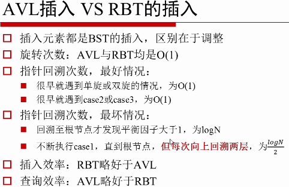

### 三、红黑树的删除操作

  删除红色节点，不会影响BH，无需操作。

  删除黑色节点，节点所在的子树的BH--，导致不平衡，需要调整。

 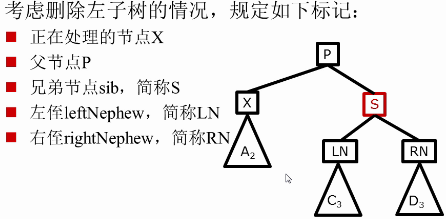

每次将节点进行染色、旋转操作，都需要考虑：

- 是否有相同BH，X的BH本身要比别的小，所以只能不变或者增加
- 是否连续红，需要染黑？还是回溯？

高层伪代码：（纠错：case4 P和S染黑-->P和RN染黑）

 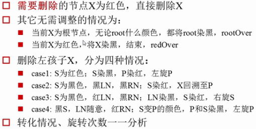


需要调整的情况：

- case 1：此时X的黑高少1

  - 条件：**兄弟节点S为红色**。隐含条件父亲P，LN,RN都为黑色。
  - 处理方式:兄弟节点S染黑，父亲P染红，左旋P，使得LN成为新的兄弟S
  - 调整之后：BH(X)比BH(LN)少1，违反BH，需要继续调整X。**不会引起BH变化。**
  - case 1可转化为：case2-2, case3, case4-1, case4-2

  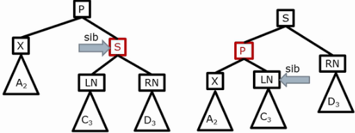

  

- case 2: 

  - 条件：兄弟S、LN、RN均为黑色
    - case2-1条件：父亲**P为黑色**
    - case2-1条件：父亲**P为红色**
  - 处理方式相同：兄弟S染红，X回溯至P
  - case2-1：**父亲P为黑色**（兄弟S、LN、RN均为黑色）
    - 调整后：（兄弟S染红，X回溯至P）
      - X的黑高不变，S的黑高减1，导致x和s黑高相同。
      - 但父亲P的黑高减小了1，真个树违反了BH相等。需要继续调整P。
    - 可转化为：所有case，因为P是黑色的。
    - 注意：**若P为根节点，则这是唯一减小真个红黑书BH的情形**。
    - 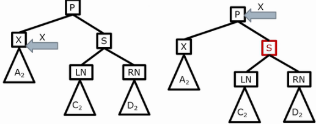
  - case2-2:**父亲P为红色**（兄弟S、LN、RN均为黑色）
    - 调整后：（兄弟S染红，X回溯至P）
      - 与case2-1一样，X的黑高不变，S的黑高减1，导致x和s黑高相同。
      - 与case2-1一样，但父亲P的黑高减小了1，真个树违反了BH相等。需要继续调整P。
      - 特别地：P与S违反了连续红。
    - 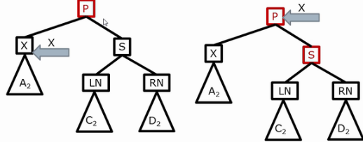
    - 转化为：这种情况下，只需要将P染黑即可，算法结束(redOver)。这样也恢复了P的黑高。
    - 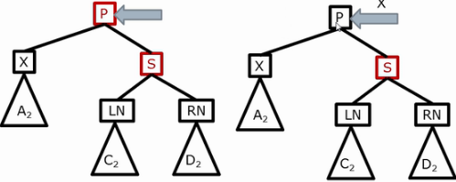

- case 3：此时X的黑高小1

  - 条件：父亲S为黑色，LN为红色，RN为黑色
  - 处理方式：LN染黑，S染红，右旋S,S指向LN
  - 调整之后：
    - S, LN的左右子树满足黑高条件
    - 但X的黑高任然比LN小1，需要继续调整X
  - 可转化为：case4-1，case4-2。不会引起黑高变化。
  - 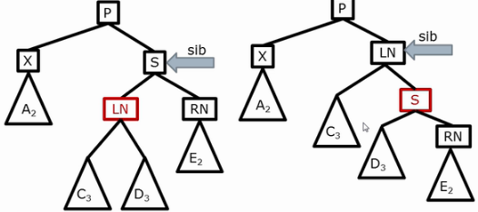

- case 4：

  - 条件：兄弟S为黑色，父亲P可红可黑，右侄子RN为红色
    - case4-1:LN为红色
    - case4-2:LN为黑色
  - 处理方式：兄弟S的颜色设置为与父亲P相同，P染黑，RN染黑，左旋P,X指向根，rootOver
  - case4-1：
    - LN为红色
    - 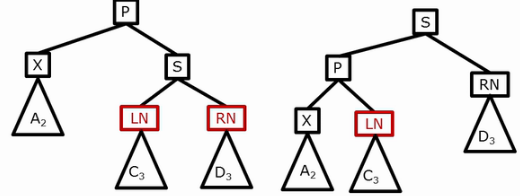
  - case4-2：
    - LN为黑色
    - 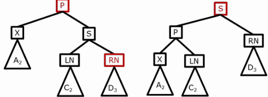
  - 调整之后：
    - 染黑后的P变为左子树，整好填补了左子树缺少的一个黑高。
    - RN染黑，正好填补了空缺的黑S，右子树黑高不变。
    - 黑S代替了原来的P,也代替了原来P的颜色。但以S为根的树满足了红黑树的性质。所以整个树都满足
    - rootOver，整个算法结束。

- 总体case：

   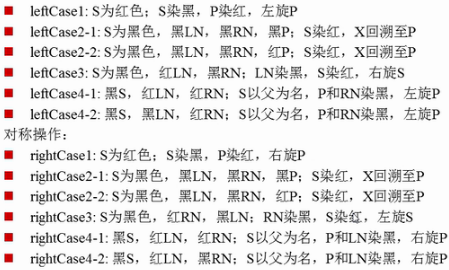

- 小结：

 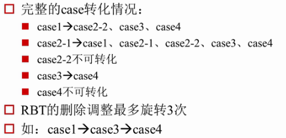

- 比较：

 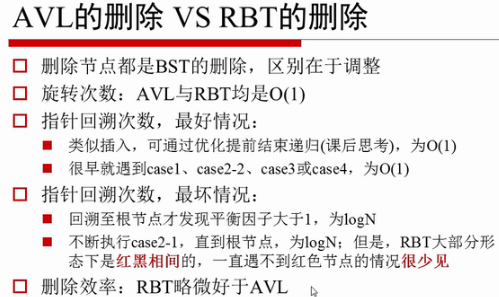

```java
public V remove(Object key) {
    Entry<K,V> p = getEntry(key);
    if (p == null)
        return null;
    V oldValue = p.value;
    deleteEntry(p);
    return oldValue;
}
/**
 * Delete node p, and then rebalance the tree.
 */
private void deleteEntry(Entry<K,V> p) {
    modCount++;
    size--;
    // If strictly internal, copy successor's element to p and then make p point to successor.
    // 1.如果p有两个孩子，则用后继节点代替当前结点，并开始删除后继节点
    if (p.left != null && p.right != null) {
        Entry<K,V> s = successor(p);//找到p的后继
        p.key = s.key;              //用后继节点赋值给当前节点，及值替换
        p.value = s.value;        
        p = s;                      //指向后继节点，即开始删除后继节点
    } // p has 2 children
    // Start fixup at replacement node, if it exists.
    // 2.如果有一个孩子，则用孩子replacement代替p（先删除，再调整）
    Entry<K,V> replacement = (p.left != null ? p.left : p.right);
    if (replacement != null) {
        // Link replacement to parent
        // 设置replacement的parent节点
        replacement.parent = p.parent;
        // 设置p的父亲指向replacement的节点
        if (p.parent == null)
            root = replacement;
        else if (p == p.parent.left)
            p.parent.left  = replacement;
        else
            p.parent.right = replacement;
        p.left = p.right = p.parent = null; //删除p
        if (p.color == BLACK)  //如果p是黑色的，则fixAfterDeletion(replacement);
            fixAfterDeletion(replacement);
    } else if (p.parent == null) { // 父亲节点为null，则说明只有p这一个节点，删除了就返回null
        root = null;
    // 3.没有孩子，即为叶子节点（先调整，再删除）
    } else { //  No children. Use self as phantom replacement and unlink.
        if (p.color == BLACK)    //如果p是黑色的，就fixAfterDeletion(p)。先调整，再删除。
            fixAfterDeletion(p);
        if (p.parent != null) { //如果是红色的，且不是根节点，则直接删除
            if (p == p.parent.left)       //如果是左孩子
                p.parent.left = null;
            else if (p == p.parent.right) //如果是右孩子
                p.parent.right = null;
            p.parent = null;
        }
    }
}
```

删除后调整算法：

```java
private void fixAfterDeletion(Entry<K,V> x) {
    while (x != root && colorOf(x) == BLACK) {
        // 如果x为左子树
        if (x == leftOf(parentOf(x))) {
            Entry<K,V> sib = rightOf(parentOf(x));//得到x的兄弟节点sib
			// case 1：兄弟节点sib为红色
            if (colorOf(sib) == RED) {
                setColor(sib, BLACK);      //sib染黑
                setColor(parentOf(x), RED);//P染红
                rotateLeft(parentOf(x));   //左旋P
                sib = rightOf(parentOf(x));//原来的LR成为新的sib兄弟
            }
			// case 2：兄弟sib，LN，RN都为黑色。（经过上面的if之后此处的sib必为黑色）
            if (colorOf(leftOf(sib))  == BLACK && colorOf(rightOf(sib)) == BLACK) {
                setColor(sib, RED);//sib染红
                x = parentOf(x);   //回溯至P
            } else {
                //case 3：sib为黑，LN为红，RN为黑
                //经过case1的if，此处的sib必然为黑
                //不满足case2，说明LN和RN不同时为黑。
                //即如果RN为黑，则LN为红
                if (colorOf(rightOf(sib)) == BLACK) {
                    setColor(leftOf(sib), BLACK);//LN染黑
                    setColor(sib, RED);          //sib染红
                    rotateRight(sib);            //右旋sib
                    sib = rightOf(parentOf(x));  //sib指向LN
                } //转为case4
                //case 4: sib为黑，RN为红， P可用可黑
                setColor(sib, colorOf(parentOf(x)));//sib设置与P颜色相同
                setColor(parentOf(x), BLACK);       //P染黑
                setColor(rightOf(sib), BLACK);      //RN染黑
                rotateLeft(parentOf(x));            //左旋P
                x = root;                           //X回溯至根节点
            }
        } else { // symmetric 如果是右子树，即对称
            Entry<K,V> sib = leftOf(parentOf(x));
            if (colorOf(sib) == RED) {
                setColor(sib, BLACK);
                setColor(parentOf(x), RED);
                rotateRight(parentOf(x));
                sib = leftOf(parentOf(x));
            }
            if (colorOf(rightOf(sib)) == BLACK &&
                colorOf(leftOf(sib)) == BLACK) {
                setColor(sib, RED);
                x = parentOf(x);
            } else {
                if (colorOf(leftOf(sib)) == BLACK) {
                    setColor(rightOf(sib), BLACK);
                    setColor(sib, RED);
                    rotateLeft(sib);
                    sib = leftOf(parentOf(x));
                }
                setColor(sib, colorOf(parentOf(x)));
                setColor(parentOf(x), BLACK);
                setColor(leftOf(sib), BLACK);
                rotateRight(parentOf(x));
                x = root;
            }
        }
    }
    setColor(x, BLACK);
}
```

### 四、示例：红黑树的插入操作

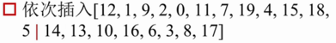

开始插入：

 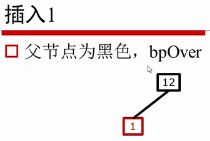 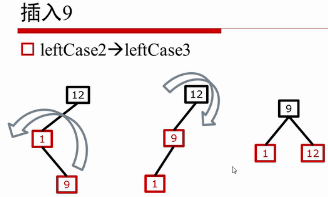 

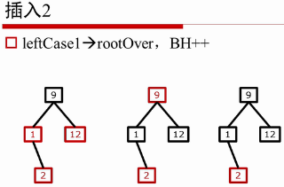 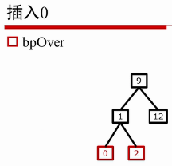 

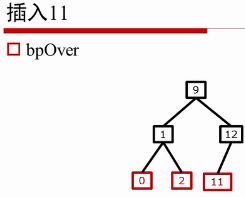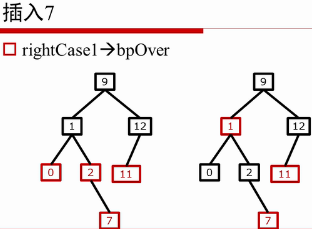 

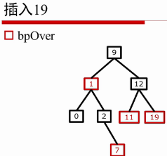 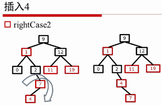 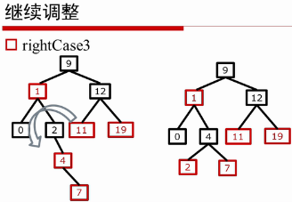  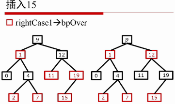

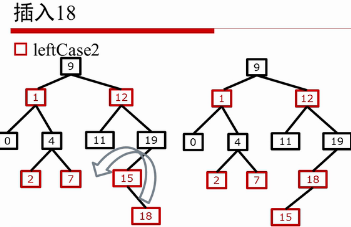 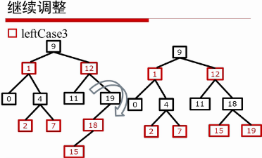

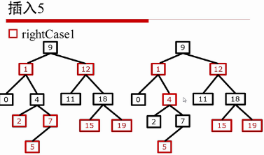 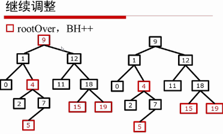

### 五、示例：红黑树的删除操作

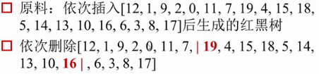

示例：

 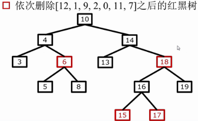 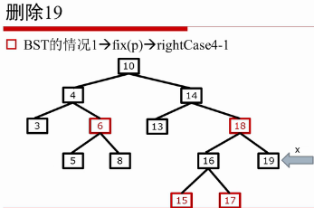

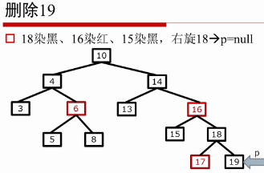 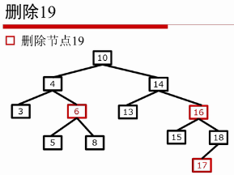

 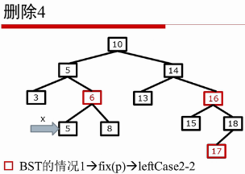

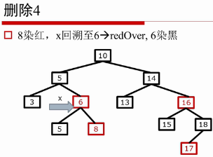 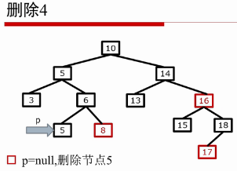

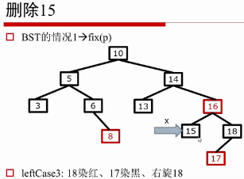 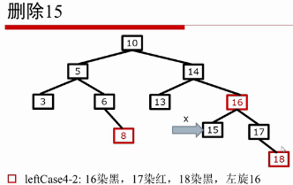

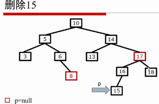 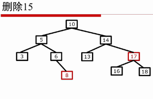

 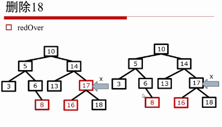

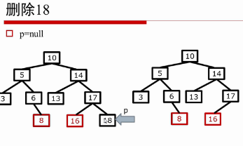 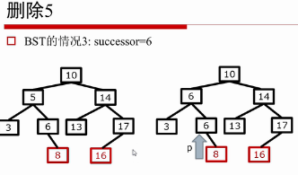

 

 


 

 

