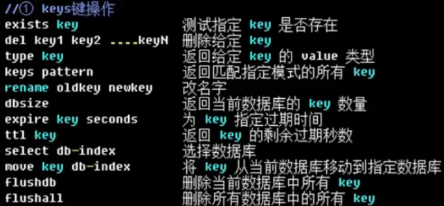
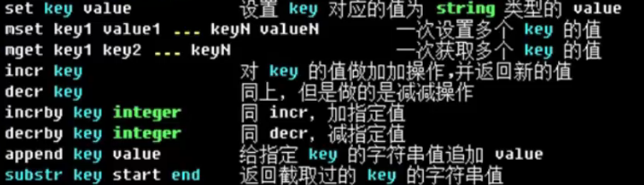
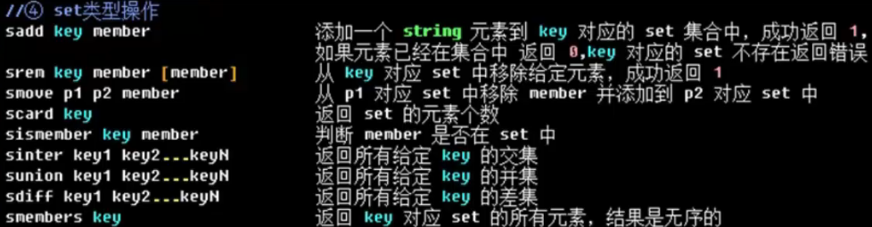
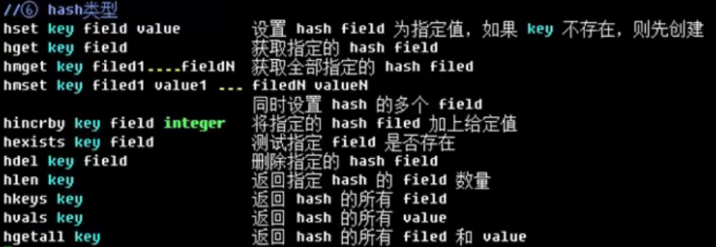

## 概念

Redis: Remote Dictionary Server。内存高速缓存数据库，使用c编写，数据模型为key-value.可持久化。支持的数据类型有:String list hash set sorted set

缓存的两种形式：

1. 页面缓存：经常用在CMS(content manage system)内存管理系统里面
2. 数据缓存：经常用在页面的具体数据里面

redis 与 memcache比较：

1. 支持的数据类型更丰富
2. 支持主从模型
3. 支持持久化
4. 单个value的最大限制是1GB, memcached只能保持1MB的数据

## 2.安装

从github上下载，然后解压，进入目录，执行make进行编译即可。

在src目录中：　

- redis-server:启动redis服务脚本的文件
- redis-cli:终端操作脚本
- redis-benchmark:压力测试文件
- redis-check-aof/dump:检测备份文件脚本

将src/redis-cli, src/redis-server, redis.conf拷贝到/usr/local/redis/下。

编辑redis.conf,将daemonize　改为yes,即后台启动。

启动：sudo ./redis-service ./redis.conf 。　查看:pa -A | grep redis

## 3.使用

./redis-cli　进入redis的终端

set name Duke设置变量。　get name 获取变量值。　默认都为字符串。

#### (1).key

key除了“\n”和空格之外，都可以作为key的名字。长度不做要求，但太长占内存，查询慢。

#### (2).String

#### (3).List

list类型就是一个双向链表，通过push,pop操作从链表的头部或者尾部添加删除元素，可做栈、队列使用。

应用：获取最新的10个登录用户信息。可以在list链表中只保留最新的10个数据，每进来一个新的数据就删除一个旧的数据。每次就可以从链表中直接获取需要的数据。避免每次从mysql中进行查询(select * from user order by logintime desc limit 10;)耗费系统资源。

#### (4).set

每个集合中元素不能重复。最大可以包含($2^{32}-1$)个元素。

#### (5).Sort Set

排序集合类型。在set的基础上，给每个元素关联一个权，通过权值可以有序地获取集合中的元素。　　

#### (6).Hash

## 4. 持久化

#### (1)snap shotting 快照持久化

默认开启，一次性把redis中全部的数据保存一份到硬盘中，如果数据非常多(10-20G)就不适合频繁进行该持久化操作。默认文件名为./dump.rdb

快照持久化频率（快慢搭配）：

save 900 1　　#900秒超过1个key被修改，则发起快照
save 300 10
save 60 10000

手动发起快照持久化：

./redis-cil (-h 127.0.0.1 -p 6379) bgsave　异步持久化（默认本机）

shut down 同步保存，并关闭redis服务器

#### (2) append only file AOP持久化

把用户执行的每个“写”指令都备份到文件中，还原数据的时候就执行具体写指令。

开启AOF持久化（会清空redis内部的数据）：配置文件中appendonly yes(需要重启)

appendfsync always 立即强制写入磁盘，最慢的，保证完全持久化，不推荐。

appendfsync everysec 每秒强制写入磁盘，折中，推荐。　

appendfsync no 依赖os

aof备份文件做优化处理（合并类似的指令）：./redis-cli bgrewriteaof 

## 5. 主从模式

主redis:写入　；从redis:查

配置文件：slaveof ipaddr port　重启后，作为ipaddr:port的slave，默认禁止写操作。