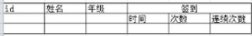
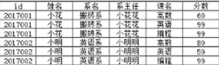

目的：

- 减少数据冗余
- 尽量避免各种异常：插入／更新／删除异常，操作的实体依赖另外的实体。
- 数据空间

参考：https://www.bilibili.com/video/av17299750?from=search&seid=2876748413019051660

数据库设计范式：　

1. 第一范式：**每一列不可再分割**

   1. 所有字段都只有单一属性

   2. 单一属性的列是由基本数据类型所构成的

   3. 设计出来的表都是简单的二维

   4. 下图不符合

      

2. 第二范式

   1. 码：一个表中，可以唯一确定一个元祖(行)的属性集合"K"。假设k为一个属性，如果k确定了，那么表里面的其它属性也就确定了。
   2. 主属性：包含在码中的属性。
   3. 函数依赖：y=f(x), y函数依赖于x。
   4. 完全函数依赖：若X->Y，且对于X的真子集X'->Y不成立。即只有全部的X才能确定Y。
   5. 部分函数依赖：若Y函数依赖X，但Y不完全依赖X　
   6. 数据表中是否存在非主属性对于码的**部分函数依赖**：(即：有没有非主属性中仅仅靠码中的真子集就可以确定的)
      1. 存在：数据表最高值符合1NF要求
      2. 不存在：符合2NF要求
   7. 如下：码(id,课名)，但姓名可以由码中的id就决定，所以不符合2NF。
   8. 解决办法：拆分表。
   9. 2NF解决的问题：减少数据冗余、修改异常

3. 3NF
   1. 在2NF上，消除了非主属性对于码的**传递函数**依赖。
   2. 传递函数依赖：如果z依赖于y,y又依赖于x,那么z依赖于x
   3. 解决办法：继续拆分表
   4. 解决问题：插入异常、删除异常

范式化设计：

- 优点：可以尽量减少数据冗余，更新才做快，表小
- 缺点：对于查询需要对多个表进行关联，性能下降；更难进行索引优化。

反范式化设计：

- 优点：可以减少表的关联；可以进行索引优化
- 缺点：存在数据冗余和数据异常；对数据的修改需要更多的成本(对于冗余数据需要修改多个地方)

