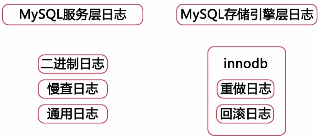
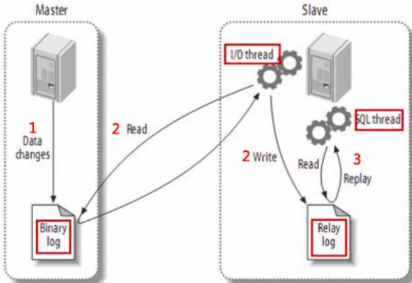
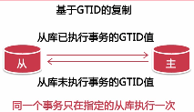

高可用

二进制日志：记录了所有对数据库的修改事件，包括增删改查、对表结构的修改事件。

- 基于段的格式，binlog_format=STATEMENT，记录的执行sql的语句
  - 优点：日志记录量相对较小，节约磁盘及网络IO
  - 缺点：必须要记录上下文信息，特点函数UUID(),user()这样非确定性函数还是无法复制，可能造成主从服务器数据不一致。
- 基于行的日志格式，binlog_format=ROW，记录了增删改差的具体数据。
  - 优点：主从复制更加安全，对每一行的修改比基于段的复制更搞效；可以通过该日志恢复记录。
  - 缺点：基于范围的修改，则需要记录每一行的数据。记录日志量较大：binlog_row_image=FULL|MINIMAL
- 混合日志格式：binlog_format=MIXED,
  - 根据SQL语句由系统决定在基于段和基于行的日志格式中进行选择
  - 数据量的大小由所执行的SQL语句决定

建议：MIXED ROW(MINIMAL)

基于sql语句的复制SBR（基于段的日志格式）:

- 优点：
  - 生成日志量少，节约网络传输IO
  - 并不强制要求主从数据库的表定义完全相同
  - 更为灵活
- 缺点：
  - 对于非确定性事件，无法保证主从复制数据的一致性
  - 对于存储过程，触发器，自定义函数进行修改也可能造成数据不一致
  - 比基于行的复制方式在执行时可能需要更多的行锁

基于行的复制RBR(基于ROW的日志格式):（推荐，因为一致性保证）

- 优点：
  - 可以应用于任何sql的复制　包括非确定性函数、存储过程等。保证主从完全一致
  - 减少数据库锁的使用。(比主数据库的锁少，因为不需要查询，只需要修改)
- 缺点：
  - 要求主从的表结构相同
  - 无法在从数据上单独执行触发器

主从复制工作原理：

步骤：

1. 主服务器要开启日志，并将变更写入二进制日志
2. 从服务器读取主服务器的二进制日志变更，并写入到relay_log中。从服务器上启动一个工作线程IOthread，与主服务器上的binlog_dump线程连接。主服务器有更改时，会给从服务器发送信号。
3. 从服务器重放relay_log中的日志，由sql thread执行。(执行sql或者直接修改数据)

基于日志点的复制配置步骤：通过复制日志进行同步，不能漏复制

1. 在主服务器上建立复制账号：CREATE USER replUser@'从IP段' identify by 'PassWord';
2. 并授权：GRANT REPLICATION SLAVE ON *.\* TO replUser@'从IP段'
3. 配置主库：
   1. bin_log=mysql-bin 启动二进制日志，并指定二进制文件，需要有写入权限
   2. server_id=100　动态参数，必须唯一
4. 配置从库：
   1. bin_log=mysql-bin 启动二进制日志，并指定二进制文件，需要有写入权限
   2. server_id=100　动态参数，必须唯一
   3. relay_log=mysql-relay-bin 指定relay_log日志目录和名字，防止名字变化
   4. log_slave_update=on　如果之后从服务器要称为主服务器，则必须配置该参数
   5. read_only=on禁止其它用户写操作
5. 初始化从服务器数据
   1. mydqldump --master-date=2 -single-transaction　备份，需要锁表
   2. xtrabackup --slave-info 对于innodb，热备份时不锁表。其余引擎则需要锁表
   3. 例：
      1. 主库备份：mysqldump --single-transcation --master-data --triggers --routines --all-databases -uroot -p >> all_backup.sql
      2. 从库导入：mysql -u root -p < all_backup.sql
6. 从库启动复制链路:指定从主库的什么文件和什么偏移量开始复制(all_back本分文件中拷贝)
   1. CHANGE MASTER TO MASTER_HOST='master_host_ip', MASTER_USER='replUser', MASTER_PASSWORD='PassWord', MASTER_LOG_FILE='mysql_log_file_name',MASTER_LOG_POS=4;
   2. show slave status；查看从库的配置
   3. start slave;启动链路
   4. show processlist;查看所有线程
7. 特性：
   1. 优点：
      1. 最早的复制技术，Bug相对少
      2. 对sql查询没有任何限制
      3. 故障处理比较容易
   2. 缺点：
      1. 故障转移时重新获取新主库的日志点信息比较困难。

基于GTID复制的：GTID即全局事务ID，保证为每一个在主上提交的事务在复制集群中可以生成一个唯一的ID。GTID=source_uuid:transaction_id.

 

步骤：

1. 在主DB上建立复制账号
2. 配置主库：
   1. bin_log=/home/mysql/log/mysql-bin 日志与数据最好分开放在不同分区
   2. server_id=100 集群唯一
   3. gtid_mode=on　启动gtid，每个事务会额外记录gtid标识
   4. enforce-gtid-consiste 强制事务一致性.但下面的操作不能使用：
      1. create table ... select不能使用
      2. 在事务中使用create temporary table 建立临时表
      3. 使用关联更新事务表和非事务表
   5. log-slave-update=on 在从中记录主发送过来的修改日志
3. 配置从库：
   1. server_id=101
   2. relay_log=relay_log
   3. gtid_mode=on
   4. enfoce-gtid-consistency
   5. read_only=on
   6. master_info_repository=TABLE 建议　从连接主的信息记录在表中，而不是文件中。innodb引擎
   7. relay_log_info_repository=TABLE　建议
4. 初始化从库
   1. 记录备份时的GTID值
5. 启动基于GTID的复制
   1. CHANGE MASTER TO MASTER_HOST='master_host_ip', MASTER_USER='replUser', MASTER_PASSWORD='PassWord', MASTER_AUTO_POSITION=1;
6. 特点：
   1. 优点:
      1. 可以很方便进行故障转移，知道有哪些事务在从上没有执行
      2. 从库不会丢失主库上的任何修改
   2. 缺点：
      1. 故障处理比较复杂
      2. 对执行sql语句有一定的限制

如何选择：

- 版本>5.6才考虑GTID
- 复制架构及主从切换的方式：GTID
- 所使用的高可用的管理组件
- 对应用的支持程度

５．７,可有多个主库

主从复制：如何减少主从复制延迟？？？

- 主库写入二进制时间：控制主库的事务大小，分割大事务
- 二进制日志传输时间：减少日志量，使用MIXED日志格式或设置set binlog_row_image=minimal;
- 主上的并发在从上变成了串行，默认情况下只有一个sql线程：>5.6，使用多线程复制。5.7中使用逻辑时钟。

５－０９

