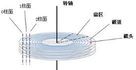

InnoDB采用两阶段锁协议，只有在commit或rollback时，释放，同一时刻释放。

InnoDB显示锁定：select .. lock in shared mode / for update

mysql在服务层实现：lock/unlock tables，不能代替事务。

多版本并发控制MVCC:乐观、悲观。

InnoDB的MVCC通过在每一行增加行的创建版本号和过期版本号来实现。每开始一个新的事务，系统版本号都会自动递增，事务开始时的系统版本号会作为事务的版本号，用来和查询的每行记录的版本号进行比较。

- insert:为插入的行保存当前系统版本号作为行版本号
- delete:为删除的每一行保存当前系统版本号为行删除标识
- update:保存当前系统版本号为行版本号，保存当前系统版本号到原来的行作为行删除标识。

- slelct:
  - 行记录在事务开始前已存在，或者被事务自身修改。即行记录的版本号<=事务系统版本号
  - 行记录在事务开始前未被删除。即行的删除版本要么未定义，要么大于事务版本号

Innodb通过间隙锁策略防止幻读。

**选择优化的数据类型**：

- 使用能正确存储数据的最小数据类型
- 使用简单类型，整形比字符操作代价低，因为字符集和校对规则比整形更复杂。使用內建类型存储时间而不是字符串，用整形存IP地址
- 避免使用NULL,因为null的列使得索引、索引统计和值比较都更复杂，甚至会存储更多的空间。
- TIMESTAMP会根据时区变化，范围小，需要的空间页小。比DATETIME。Mysql会在索引中存储NULL值，而oracle不会。

整数类型：(unsigned) tinyint8, smallint16, mediumint24, int32, bigint64.$-2^{N-1} ... 2^{N-1}-1$，整数计算一般使用64位的BIGINT。聚合函数除外。 INT(1)与INT(20)是一样的。

实数类型：float4, double8, decimal(比bigint还大).double为内部浮点计算类型。其实可以将decimal转为bitint。3.14 314

字符串：>5.0 保留末尾空格

- varchar:<256,1;否则需要2个字节来存储长度。节约空间，但性能下降。如果将原来行记录的字符串更新为更长的字符串，在页内没有更多的存储空间，则需要进行单独处理。innodb:分裂页使行可以放进页内。适合场景：
  - 字符串的最大长度比平均长度长很多
  - 列的更新少
  - 使用了UTF-8的复杂字符集
- char:定长。会丢弃末尾空格？
- 只分配需要的空间更好。

binary varbinary:二进制，数据比较时，只比较二进制数，所以性能高。

blob:二进制存储字符换，没有字符集和排序规则

text:字符方式存储，有字符集和排序规则

因为字符太大，InnoDB会在行内存储1~4个字节的指针，指向外部存储区域的实际值。在排序时，只对前面的部分字符进行排序，或者使用 order by sustring(column, length)

枚举：将常用的字符串用枚举来表示，内部转为整形数字。

datetime:与时区无关，存为yyyymmddhhmmss整数

timestamp:from_unixtime(), unix_timestamp()默认not null

bit:底层作为字符串处理，而不是数字。慎用。true/false可用char(0)代替，null/长度为0的字符串。

set:内部以一系列打包的位的集合来表示。缺点：改变列的定义的代价较高。可以在整数列上按位操作来代替。

mysql在内部使用整存储ENUM和SET，在比较的时候转为字符串。

确保在关联表时使用相同的数据类型。

标识类选择：

- 枚举：避免
- 字符串类型：消耗空间，比整数慢。MyISAM默认对字符串使用压缩索引，导致查询慢。避免使用随机字符串：因为插入值会随机写到索引的不同位置，导致页分裂，磁盘随机访问。逻辑上相邻的行会分布在磁盘和内存的不同地方。

IP:用INET_ATON()和INET_NTOA()在字符串和整数间转换。

MySQL schema设计：

- 避免太多列，存储引起通过行缓冲拷贝到服务层，服务层将缓冲内容解码成各个列，将编码过的列转换成行数据结构的操作代价非常高。MyISAM的定长结构与服务层的行相匹配，所以不需要转换。
- 避免太多的关联，12个以内。规定61个以内。
- 防止过多的枚举

## 5. 创建高性能索引

磁盘IO:参考：http://www.360doc.com/content/11/1103/13/6938655_161335261.shtml

磁盘上数据必须用一个三维地址唯一标示：柱面号、盘面号、块号(磁道上的盘块)。

读/写磁盘上某一指定数据需要下面3个步骤：

(1)  首先移动臂根据柱面号使磁头移动到所需要的柱面上，这一过程被称为定位或查找 。

(2)  如上图11.3中所示的6盘组示意图中，所有磁头都定位到了10个盘面的10条磁道上(磁头都是双向的)。这时根据盘面号来确定指定盘面上的磁道。

(3) 盘面确定以后，盘片开始旋转，将指定块号的磁道段移动至磁头下。

经过上面三个步骤，指定数据的存储位置就被找到。这时就可以开始读/写操作了。

访问某一具体信息，由3部分时间组成：

● 查找时间(seek time) Ts: 完成上述步骤(1)所需要的时间。这部分时间代价最高，最大可达到0.1s左右。

● 等待时间(latency time) Tl: 完成上述步骤(3)所需要的时间。由于盘片绕主轴旋转速度很快，一般为7200转/分(电脑硬盘的性能指标之一, 家用的普通硬盘的转速一般有5400rpm(笔记本)、7200rpm几种)。因此一般旋转一圈大约0.0083s。

● 传输时间(transmission time) Tt: 数据通过系统总线传送到内存的时间，一般传输一个字节(byte)大概0.02us=2*10^(-8)s

**磁盘读取数据是以盘块**(block)**为基本单位的。**位于同一盘块中的所有数据都能被一次性全部读取出来。而磁盘IO代价主要花费在查找时间Ts上。因此我们应该尽量将相关信息存放在同一盘块，同一磁道中。或者至少放在同一柱面或相邻柱面上，以求在读/**写信息时尽量减少磁头来回移动的次数，避免过多的查找时间**Ts**。**

所以，在大规模数据存储方面，大量数据存储在外存磁盘中，而在外存磁盘中读取/写入块(block)中某数据时，首先需要定位到磁盘中的某块，如何有效地查找磁盘中的数据，需要一种合理高效的外存数据结构，就是下面所要重点阐述的B-tree结构，以及相关的变种结构：**B+-tree结构和B\*-tree结构。**

B-tree:n个关键字的节点有n+1个子树。开区间。可以在非叶子节点命中。树高：h = logt((n+1)/2);t为最小度(节点最少的关键字个数)。

模拟查找关键字29的过程：

1. 根据根节点找到磁盘块1，读入内存。【磁盘I/O操作第1次】
2. 比较关键字29在区间（17,35），找到磁盘块1的指针P2。
3. 根据P2指针找到磁盘块3，读入内存。【磁盘I/O操作第2次】
4. 比较关键字29在区间（26,30），找到磁盘块3的指针P2。
5. 根据P2指针找到磁盘块8，读入内存。【磁盘I/O操作第3次】
6. 在磁盘块8中的关键字列表中找到关键字29。

总结：B+Tree是在B-Tree基础上的一种优化，使其更适合实现外存储索引结构，InnoDB存储引擎就是用B+Tree实现其索引结构。

从上一节中的B-Tree结构图中可以看到每个节点中不仅包含数据的key值，还有data值。而每一个页的存储空间是有限的，如果data数据较大时将会导致每个节点（即一个页）能存储的key的数量很小，当存储的数据量很大时同样会导致B-Tree的深度较大，增大查询时的磁盘I/O次数，进而影响查询效率。在B+Tree中，所有数据记录节点都是按照键值大小顺序存放在同一层的叶子节点上，而非叶子节点上只存储key值信息，这样可以大大加大每个节点存储的key值数量，降低B+Tree的高度。

B+tree:

- 非叶子结点的子树指针与关键字个数相同；
- [k,i)左闭右开
- 只有到叶子结点才命中；所有叶子节点增加一个链指针。
- 所有关键字都出现在叶子节点的链表中(稠密索引)，且链表中的关键字恰好有序。

