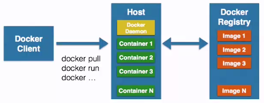

#### 什么是容器：
 - 一种虚拟化的解决方案。
 - 操作系统级别的虚拟化。
 - 只能运行在相同或相似内核的操作系统中
 - 依赖与Linux内核特性：Namespace和Control Group

#### Linux容器技术相比于虚拟机的优点：
 - 资源和空间的减少：容器只需包含应用和依赖的库，不需要OS（虚拟机需要）。虚拟机需要模仿硬件行为。

#### Docker简介
 - 将应用程序自动部署到容器的开源引擎。
 - Go语言开源引擎（github上）
 - Docker的目标：
   -  提供简单轻量的建模方式
   -  职责的逻辑分离（开发、运维）
   -  快速搞笑的开发生命周期（开发和部署环境都一样）
   -  鼓励使用面向服务的架构（单个容器只运行一个程序或进程）。比较统一定位问题所在。
 - Docker的使用场景：
   -  使用Docker容器开发、测试、部署服务
   -  创建隔离的运行环境
   -  构建多用户的平台即服务（PaaS）基础设施
   -  提供软件即服务（SaaS）应用程序
   -  高性能、超大规模的宿主机部署

#### Docker的基本组成
-  Docker Client客户端/守护进程
- C/S架构
  -  本地/远程
- Docker Image镜像
  -  容器的基石
  -  层叠的只读文件系统 
  -  联合加载(union mount).bootfs->rootfs(ubuntu)->add emace/addApache->可写层
- Docker Container容器
  - 通过镜像加载
  - 启动和执行阶段 
  - 写时复制（copy on write）
- Docker Registry仓库
  - 共有
  - 私有
  - Docker Hub  
- Docker的基本组成：

#### 容器相关技术
##### Namespace命名空间
 - 编程语言：封装->代码隔离
 - 操作系统：系统资源的隔离->进程、网络、文件系统。。。
 - 五种命名空间：
   -  PID（Process ID）进程隔离
   -  NET（Network）管理网络接口
   -  IPC（InterProcess Communication）管理跨进程通信的访问
   -  MNT（Mount）管理挂载点
   -  UTS（Unix Timesharing System）隔离内核和版本标识
##### Control group控制组
 - 用来分配资源，来源与google
 -  资源限制
 -  优先级设定
 -  资源计量
 -  资源控制（挂起和恢复）
##### Docker容器的能力
 - 文件系统隔离：每个容器都有自己的root文件系统
 - 进程隔离：每个容器都运行在自己的进程环境中
 - 网络隔离：容器间的虚拟网络接口和IP地址都是分开的
 - 资源隔离和分组：使用cgroups将CPU和内存之类的资源独立分配给每个Docker容器

### Ubuntu安装Docker
 - 安装前检查：
   -  内核版本：uname -a
   -  检查Device Mapper：ls -l /sys/class/misc/device-mapper
 - 安装Docker维护的版本：
   -  1、检查APT的HTTPS支持，查看/usr/lib/apt/methods/https文件是否存在。如果不存在，则执行：apt-get install -y apt-transport-https
   -  2、添加Docker的APT仓库：echo deb https://get.docker.com/ubuntu docker main > /etc/apt/sources.list.d/docker.list
   -  3、添加仓库的key：apt-key adv --keyserver hkp://keyserver.ubuntu.com:80 --recv-keys 36A1D786245C8950F966E92D8576A8BA88D21E9
   -  4、安装：apt-get install -y lxc-docker
 - 通过官方脚本一键安装：curl -sSL https://get.docker.com/ | sudo sh
 - 安装成功后，必须以root权限运行。只需要建立一个docker组，并将当前用户加入docker组即可避免。
   - sudo groupadd docker 创建docker组
   - sudo gpasswd -a ${USER} docker 将当前用户加入docker组
   - sudo service docker restart 重新启动docker
   - 退出并重新登录