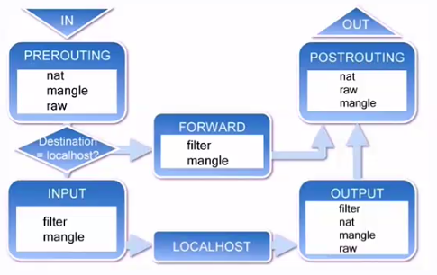
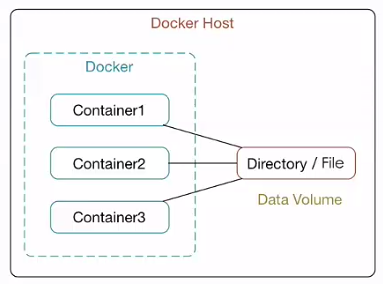
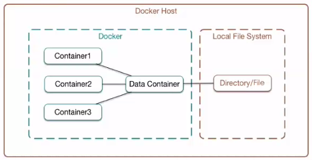
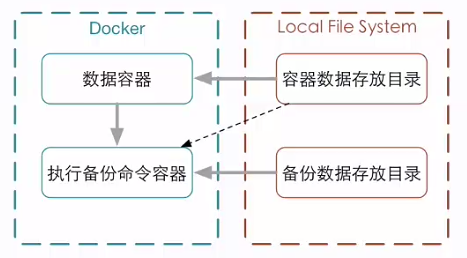
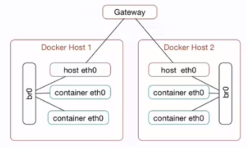
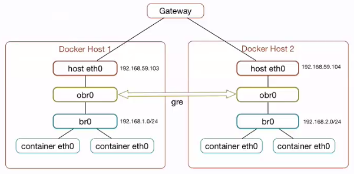
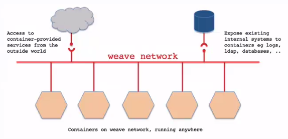

 - 显示运行：
    - docker run ubuntu echo 'Hello World!' 在ubuntu镜像上运行
    - docker run -i -t --name=container01 ubuntu /bin/bash 其中：-i interactive -t tty
    - docker ps -a / -l 其中：-a all 无参时查看正在运行的容器
    - docker inspect container01 查看容器的详细信息
    - docker start -i container01 交互式地启动该容器
    - docker rm container01 删除
    - docker stop container01
    - docker kill container01
 - 守护运行：
    - 方式一：
        - docker run -i -t IMAGE /bin/bash 启动容器
        - Ctrl+P Ctrl+Q 后台运行
        - docker attach dockername 返回dockername容器
    - 方式二：
        - docker run -d IMAGE [COMMAND] [ARG...] 
 - 查看容器日志：
    - docker logs [-f] [-t] [--tail] container01
        - -f --fellows=false
        - -t --timestamps=false
        - --tail="all" 
        - 例：docker logs -ft --tail 0 container01
 - 查看容器进程：docker top containers01
 - 在运行中的容器内启动新进程：
    - docker exec [-d] [-i] [-t] container01 [COMMAND [ARG...] 
#### 设置容器的端口映射
 - docker port container01 查看端口映射情况（docker ps也可以）
 - run [-P] [-p] 
    - -P --publish-all=false 为容器暴露所有端口进行映射
    - -p --publish=[] 指定端口。
        - docker run -p 80 -i -t ubuntu /bin/bash 宿主机随机映射到容器80端口
        - docker run -p 8080:80 -i -t ubuntu /bin/bash 对应端口映射 
        - docker run -p 0.0.0.0:80 -i -t ubuntu /bin/bash
        - docker run -p 0.0.0.0:8080:80 -i -t ubuntu /bin/bash
#### docker
 - 镜像存储位置：/var/lib/docker (通过docker info 查看)
 - docker images查看镜像
 - 查看镜像：docker inspect [OPTIONS] CONTAINER|IMAGE [CONTAINER|IMAGE]
 - 删除镜像：docker rmi [OPTIONS] IMAGE [IMAGE...]
    - -f, --force=false Force removal of the image
    - --no-prune=false Do not delete untagged patents
 - Image id 可以对应于多个tag。
    - docker rmi ubuntu:12.04 删除ubuntu仓库中标签为12.04的镜像（如果该镜像对应多以标签，则只删除标签）
    - docker rmi $(docker images -q ubuntu) 删除ubuntu中的所有镜像
####获取和推送镜像
 - 搜索：Docker Hub：https://registry.hub.docker.com  或者（docker search ubuntu）
 - 拉取：
    - pull ubuntu:16.04
    - 使用--registry-mirrot选项
        - 1、修改/etc/default/docker
        - 2、添加DOCKER_OPTS="--registry-mirror=http://MIRROR_ADDR（DAOCLOUD加速器地址）" 
 - 推送：docker push container01 （需要Docker Hub账号）
#### 构建镜像
 - 以软件的形式打包并分发服务及其运行环境
 - 1、docker commit -a 'Author' -m 'message' container01 new_container02 
 - 2、使用Dockerfile构建镜像
    - a、在当前目录创建一个Dockerfile，df_test1
        ```txt
        From ubuntu:16.04
        MAINTAINER author "author@outlook.com"
        RUN apt update
        RUN apt install -y nginx
        EXPOSE 80   #在使用时，还必须在命令中指定该端口
        ```  
    - b、docker build -t='dormancypress/df_test1' .
 - 启动配置文件：/etc/default/docker
 - c/s远程访问：
    - 服务器端：在/etc/default/docker中添加：DOCKER_OPTS="-H tcp://0.0.0.0:2375 -H unix:///var/run/docker.sock"
    - 客户端：
        - export DOCKER_HOST="tcp://serverIP:2375" 访问远程
        - export DOCKER_HOST="" 访问本地
#### Dockerfile指令：
 - dockerfile中的CMD指令会被命令中的指令覆盖，但ENTRYPOINT不会被覆盖。
 - COPY 复制(源相对路径 目标绝对路径)
 - ```txt
    FROM ubuntu:16.04
    MAINTAINER author "author@mail.com"
    RUN apt update
    RUN apt install -y nginx
    COPY index.html /usr/share/nginx/html/
    EXPOSE 80
    ENTRYPOINT ["/usr/sbin/nginx", "-g", "daemon off"]
 - ```
 - WORKDIR /path/to/workdir 改变工作目录
 - ENV <key> <value> / ENV <key>=<value>... 设置环境变量
 - USER daemon 指定运行容器的用户,默认为root
 - ONBUILD
#### Dockerfile构建过程
 - 基本过程：
    - 1、从基础镜像运行一个容器(FROM指定基础镜像)
    - 2、执行一条指令，对容器做出修改
    - 3、执行类型docker commit的操作，提交一个新的镜像层
    - 4、再基于刚提交的镜像运行一个新的容器
    - 5、指定Dockerfile中的下一条指令，直至所有指令执行完毕
 - 构建缓存：在构建过程中，每一步的镜像都缓存下来，下一次构建用到时，直接使用缓存。如果不适用缓存，则使用：docker build --no-cache. 也可以通过ENV REFRESH_DATE 2018-01-14 来对后面的命令进行缓存刷新
 - docker history [image] 查看镜像的构建过程
#### Docker容器的网络连接   
##### Docker容器的网络基础-docker0
 - docker0是linux中的虚拟网桥（数据链路层,通过mac地址进行地址换分和传递）
 - Linux虚拟网桥的特点：可以设置IP地址，相当于拥有一个隐藏的虚拟网卡
 - docker0的地址划分：IP：172.17.42.1 子网掩码：255.255.0.0 总共提供了65534个地址
    -  
    - 安装网桥管理工具：sudo apt install bridge-utils
    - sudo brctl show 查看网桥设备
    - sudo ifconfig docker0 192.168.200.1 netmask 255.255.255.0 自定义IP地址
 - 使用自定义网桥：
    - 1、添加虚拟网桥：sudo brctl addbr br0
    - 2、设置br0：sudo ifconfig br0 192.168.100.1 netmask 255.255.255.0
    - 3、更改docker守护进程的启动配置：/etc/default/docker中添加DOCKER_OPS值 -b=br0 
##### Docker容器的互联
 - 默认情况下，允许所有容器互联 --icc=true；拒绝所有 -icc=false
 - 为避免ip地址变化带来的影响，使用别名：docker run --link=[CONTAINER_NAME02]:[ALIAS] [IMAGE] [COMMAND]
 - 允许特定容器间的连接，使用--icc=false --iptables=true --link  

##### Docker容器与外部网络的连接 ip_forward iptables 允许端口映射访问 限制ip访问  
 - 默认 --ip-forawrd=true 通过sysctl net.ipv4.conf.all.forawrding查看  
  
 - iptables中的概念：
    - 表（table)：同样的操作抽象为表（nat、filter、raw等等）
    - 链（chain)：数据处理中的不同环节
    - 规则（rule):每个链下面的规则。ACCPET、REJECT、DROP
 - filter表中包含的链：INPUT、FORWARD、OUTPUT 
 - 查看filter表：sudo iptables -t filter -L -n
 - 添加规则阻止访问：sudo iptables -I DOCKER -s 10.211.55.3 -d  172.17.0.7 -p TCP --dport 80 j DROP

#### Docker容器的数据管理
##### Docker容器的数据卷
- 数据卷时经过特殊设计的目录，可以绕过联合文件系统（UFS)，为一个或多个容器提供访问。
- 数据卷设计的目的，在于数据的永久化，它完全独立与容器的生存周期，因此，Docker不会在容器删除时删除其挂载的数据卷，也不会存在类似的垃圾收集机制，对容器引用的数据卷进行处理。   

- 数据卷的特点：
    - 数据卷在容器启动时初始化，如果容器使用的镜像在挂载点包含了数据，这些数据会拷贝到新初始化的数据卷中。
    - 数据卷可以在容器之间共享和重用
    - 可以对数据卷里的内容直接进行修改
    - 数据卷的变化不会影响镜像的更新
    - 卷会一直存在，即使挂载数据卷的容器已经被删除
- 运行容器并为容器添加数据卷：sudo docker run -v ~/container_data:/data -it ubuntu /bin/bash
- 为容器指定为只读权限：sudo docker run -v ~/container_data:/data:ro --name dvt1 ubuntu /bin/bash
- dockerfile中创建数据卷：VOLUMN ["/data1","/data2"],每个容器都会创建不同的数据卷，无法指定host中的目录，但可通过inspect命令查看。
##### Docker的数据卷容器
 - 数据卷容器：命名的容器挂载数据卷，其他容器通过挂载这个容器实现数据共享，挂载数据卷的容器，就叫做数据卷容器。  
  
 - 新建容器挂载的数据卷容器：docker run --volumes-from [CONTAINER_NAME]
 - 本质：数据卷容器仅仅将数据卷的配置传递到新的容器中。即使删除数据卷容器，已挂载的容器任然可以访问到之前挂载的目录文件。
##### Docker数据卷的备份和还原
  
启动一个备份容器dvt10，将dvt5容器中的/datavolume1目录备份为~/backup/dvt5.tar： docker run --volumes-from dvt5 -v ~/backup:/backup --name dvt10 ubuntu tar cvf /backup/dvt5.tar /datavolume1
#### Docker容器的跨主机连接
##### 使用网桥实现跨主机容器连接  

 - 优点：配置简单、不依赖第三方软件
 - 缺点：与主机在同网段、需要小心划分IP地址，需要有网段控制权，不容易管理、兼容性不佳
##### 使用Open vSwitch实现跨主机容器连接：
 - Open vSwitch是一个高质量、多层虚拟交换机，使用开源Apache2.0许可协议，由Nicira Network开发，主要实现代码为可移植的C代码。它的目的是让大规模网络自动化可以通过编程扩展，同时任然支持标准的管理接口和协议。
  
 - GRE隧道（通用路由协议封装）：隧道技术（Tunneling）是一种通过使用互联网络的基础设置在网络之间传递数据的方式。使用隧道传递的数据可以时不同协议的数据阵或包。隧道协议将其它协议的数据帧或包重新封装，然后通过隧道发送。新的帧头提供路由信息，以便通过互联网传递被封装的负载数据。点对点。
 - ```txt
   添加ovs虚拟网桥：
   sudo ovs-vsctl add-br obr0
   为ovs虚拟网桥添加gre0：
   sudo ovs-vsctl add-port obr0 gre0
   设置gre0为gre隧道，并添加远程主机ip：
   sudo ovs-vsctl set interface gre0 type=gre options:remote_ip=192.168.59.104
   sudo ovs-vsctl show

   添加虚拟网桥：
   sudo brctl addbr br0
   为虚拟网桥设置ip：
   sudo ifconfig br0 192.168.1.1 newmask 255.255.255.0
   为虚拟网桥添加ovs网桥：
   sudo brctl addif br0 obr0
   sudo brctl show

   使用新建的网桥代替docker的默认网桥docker0
   sudo vim /etc/default/docker
   sudo service docker restart

   route 查看本机路由表
   增加路由表，通过eth0在主机192.168.59.104上查找192.168.2.0/24网段：
   sudo ip route add 192.168.2.0/24 via 192.168.59.104 dev eth0
 - ```
##### 使用weave实现跨主机容器连接：
 - weave：建立一个虚拟的网络，用于将运行在不同主机的Docker容器连接起来

 - 下载并安装
```txt
sudo wget -O /usr/bin/weave https://raw.github..../weave
sudo chmod a+x /usr/bin/weave
weave launch //通过容器安装？
通过weave创建镜像，并指定镜像的ip，需要互相访问的ip必须在同一个网段内：
主机1中wc1镜像：weave run 192.168.1.10/24 -it --name wc1 ubuntu /bin/bash
主机2中wc2镜像：weave run 192.168.1.9/24 -it --name wc2 ubuntu /bin/bash

docker attach wc1
即可在wc1中访问wc2（或在wc2中访问wc1）
```

