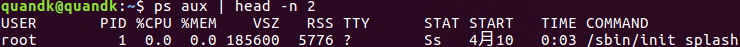
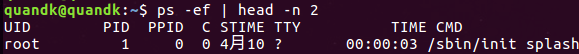
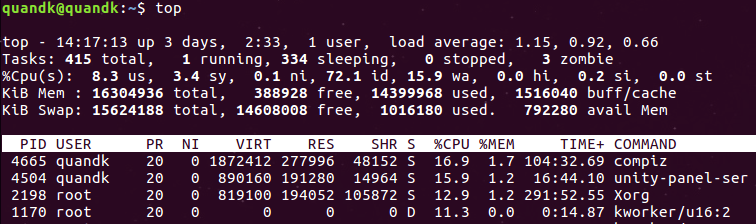
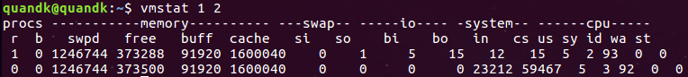

## 1. ps

ps确定有哪些进程正在运行和运行的状态、进程是否结束、进程有没有僵死、哪些进程占用了过多的资源等等.

### 1.1 常见项

1）ps  a 显示现行终端机下的所有程序，包括其他用户的程序。
2）ps -A 显示所有进程。
3）ps  c 列出程序时，显示每个程序真正的指令名称，而不包含路径，参数或常驻服务的标示。
4）ps -e 此参数的效果和指定"A"参数相同。
5）ps  e 列出程序时，显示每个程序所使用的环境变量。
6）ps  f 用ASCII字符显示树状结构，表达程序间的相互关系。
7）ps -H 显示树状结构，表示程序间的相互关系。
8）ps -N 显示所有的程序，除了执行ps指令终端机下的程序之外。
9）ps  s 采用程序信号的格式显示程序状况。
10）ps S 列出程序时，包括已中断的子程序资料。
11）ps -t<终端机编号> 　指定终端机编号，并列出属于该终端机的程序的状况。
12）ps u 以用户为主的格式来显示程序状况。
13）ps x 显示所有程序，不以终端机来区分。

通过进程名称获得进程ID:pgrep nginx、pidof nginx

### 1.2 ps aux

BSD风格　command会截断处理 (与ps -aux有点区别，建议使用aux)

a 终端机下的所有程，　u以用户为主，　x显示包括没有终端控制的进程状况

USER：用户名称 
PID：进程号 
%CPU：进程占用CPU的百分比 
%MEM：进程占用物理内存的百分比 
VSZ：进程占用的虚拟内存大小（单位：KB） 
RSS：进程占用的物理内存大小（单位：KB） 
TT：终端名称（缩写），若为？，则代表此进程与终端无关，因为它们是由系统启动的 
STAT：进程状态

- S-睡眠，s-表示该进程是会话的先导进程
- N-表示进程拥有比普通优先级更低的优先级
- R-正在运行
- D-短期等待
- Z-僵死进程
- T-被跟踪或者被停止等等 
  - < 高优先级进程 高优先序的进程
  - N 低优先 级进程 低优先序的进程
  - L 内存锁页 Lock 有记忆体分页分配并缩在记忆体内
  - s 进程的领导者（在它之下有子进程）
  - l 多进程的（使用 CLONE_THREAD, 类似 NPTL pthreads）
  - 位于后台的进程组 

STARTED：进程的启动时间 
TIME：CPU时间，即进程使用CPU的总时间 
COMMAND：启动进程所用的命令和参数，如果过长会被截断显示 

### 1.3 ps -ef

System V风格，不会截断，多了UID, PPID

 -e 显示当前运行的每一个进程信息，-f显示一个完整的列表。

UID：用户ID 
PID：进程ID 
PPID：父进程ID 
C：CPU用于计算执行优先级的因子。数值越大，表明进程是CPU密集型运算，执行优先级会降低；数值越小，表明进程是I/O密集型运算，执行优先级会提高 
STIME：进程启动的时间 
TTY：完整的终端名称 
TIME：CPU时间 
CMD：完整的启动进程所用的命令和参数

### 1.4 常见搭配

1. ps -aux | more　分页查看
2. ps -aux > ps001.txt 把所有进程显示出来，并输出到ps001.txt文件
3. ps -o pid,ppid,pgrp,session,tpgid,comm 输出指定的字段
4. ps -aux --sort -pcpu | less 根据 CPU 使用来升序排序
5. ps -aux --sort -pmem | less 根据 内存使用 来升序排序
6. pstree 树形显示进程
7. ps -u user 查看特定用户user进程
8. ps -C getty 通过进程名过滤
9. ps -aux | grep 过滤信息(名字、用户、pid等等)

## 2. top

基本单位：**进程**

### 2.1基本使用

1. 系统时间、开机运行时间、当前登录用户、负载(1min, 5min, 15min)。每隔5秒钟检查一次活跃的进程数，然后按特定算法计算出的数值。如果这个数除以逻辑CPU的数量，结果高于5的时候就表明系统在超负荷运转了。
2. 总进程数、１个运行、334个sleep、0个stopped、3个僵尸进程
3. 用户、内核、改变过优先级进程、空闲CPU、IO等待占用、硬中断、软中断　占用CPU百分比
4. 物理内存总量、空闲、使用中(交给内核管理的内存)、缓存的内存量
5. 交换分区总量、空闲、使用中、缓冲的交换区总量

pid,所有者，进程优先级，nice值(负数表示优先级越高)，使用的虚拟内存总量，使用的未被换出的物理内存大小，共享内存，进程状态，上次更新到现在的cpu时间占用百分比，物理内存百分比，使用CPU总时间(单位1/100秒)，进程名字。

### 2.2交互子命令

1. f: 字段详细解释
2. P：以占据的CPU百分比大小排序
3. M：以占据Memory空间大小排序
4. T：CPU累积占用时间排序
5. 数字建“１”：监控每个逻辑CPU的状况，即将上面第３行展开。
6. k: 终止指定进程
7. -n #: 显示的批次数量

## 3. htop

需要单独安装，交互式的，非常方便。可以输入“？”进入帮助菜单。

## 4.kill

发送指定的信号到相应进程。不指定型号将发送SIGTERM（15）终止指定进程。如果任无法终止该程序可用“-KILL” 参数，其发送的信号为SIGKILL(9) ，将强制结束进程，使用ps命令或者jobs 命令可以查看进程号。

-l  信号，若果不加信号的编号参数，则使用“-l”参数会列出全部的信号名称

-a  当处理当前进程时，不限制命令名和进程号的对应关系

-p  指定kill 命令只打印相关进程的进程号，而不发送任何信号

-s  指定发送信号

-u  指定用户 

常见搭配：

1. kill -l 列出所有信号名称
2. ps -ef|grep vim , kill 3268  先用ps查找进程，然后用kill杀掉\
3. kill –9 3268 彻底杀死进程
4. kill -9 $(ps -ef | grep peidalinux)或者kill -u peidalinux杀死用户所有进程。
5. killall nginx　命令删除了所有nginx进程（包括父进程以及父进程所产生的子进程）

## ５. vmstat

查看整个服务器的状态。

每隔1秒采样一次，一共采样2次。

**r** 表示运行队列(就是说多少个进程真的分配到CPU)，我测试的服务器目前CPU比较空闲，没什么程序在跑，当这个值超过了CPU数目，就会出现CPU瓶颈了。这个也和top的负载有关系，一般负载超过了3就比较高，超过了5就高，超过了10就不正常了，服务器的状态很危险。top的负载类似每秒的运行队列。如果运行队列过大，表示你的CPU很繁忙，一般会造成CPU使用率很高。

**b** 表示阻塞的进程,这个不多说，进程阻塞，大家懂的。

**swpd** 虚拟内存已使用的大小，如果大于0，表示你的机器物理内存不足了，如果不是程序内存泄露的原因，那么你该升级内存了或者把耗内存的任务迁移到其他机器。

**free**   空闲的物理内存的大小，我的机器内存总共8G，剩余3415M。

**buff**   Linux/Unix系统是用来存储，目录里面有什么内容，权限等的缓存，我本机大概占用300多M

**cache** cache直接用来记忆我们打开的文件,给文件做缓冲，我本机大概占用300多M(这里是Linux/Unix的聪明之处，把空闲的物理内存的一部分拿来做文件和目录的缓存，是为了提高 程序执行的性能，当程序使用内存时，buffer/cached会很快地被使用。)

**si**  每秒从磁盘读入虚拟内存的大小，如果这个值大于0，表示物理内存不够用或者内存泄露了，要查找耗内存进程解决掉。我的机器内存充裕，一切正常。

**so**  每秒虚拟内存写入磁盘的大小，如果这个值大于0，同上。

**bi**  块设备每秒接收的块数量，这里的块设备是指系统上所有的磁盘和其他块设备，默认块大小是1024byte，我本机上没什么IO操作，所以一直是0，但是我曾在处理拷贝大量数据(2-3T)的机器上看过可以达到140000/s，磁盘写入速度差不多140M每秒

**bo** 块设备每秒发送的块数量，例如我们读取文件，bo就要大于0。bi和bo一般都要接近0，不然就是IO过于频繁，需要调整。

**in** 每秒CPU的中断次数，包括时间中断

**cs** 每秒上下文切换次数，例如我们调用系统函数，就要进行上下文切换，线程的切换，也要进程上下文切换，这个值要越小越好，太大了，要考虑调低线程或者进程的数目,例如在apache和nginx这种web服务器中，我们一般做性能测试时会进行几千并发甚至几万并发的测试，选择web服务器的进程可以由进程或者线程的峰值一直下调，压测，直到cs到一个比较小的值，这个进程和线程数就是比较合适的值了。系统调用也是，每次调用系统函数，我们的代码就会进入内核空间，导致上下文切换，这个是很耗资源，也要尽量避免频繁调用系统函数。上下文切换次数过多表示你的CPU大部分浪费在上下文切换，导致CPU干正经事的时间少了，CPU没有充分利用，是不可取的。

**us** 用户CPU时间，我曾经在一个做加密解密很频繁的服务器上，可以看到us接近100,r运行队列达到80(机器在做压力测试，性能表现不佳)。

**sy** 系统CPU时间，如果太高，表示系统调用时间长，例如是IO操作频繁。

**id**  空闲 CPU时间，一般来说，id + us + sy = 100,一般我认为id是空闲CPU使用率，us是用户CPU使用率，sy是系统CPU使用率。

**wt** 等待IO CPU时间。

## 6.dstat

几乎全能，需要安装。

## 7.后台运行

1、对于已经启动并处于运行中的作业：只用ctrl+z就可以将进程送到后台.作业被送往后台后，默认处于stopped状态；

2、对于尚未启动的作业：COMMAND &

注意: 此两类方式相关作业，仍然与终端相关；终端终止，将会导致与此终端相关的所有作业被终止；

剥离进程与终端的关系：

 # nohup COMMAND &

jobs：显示作业号、作业状态、启动命令行程序

fg：将后台的程序调到前台中来

bg：将前台程序放到后台去运行

进程优先级调整：

​    静态优先级：

​        通过指定进程的nice值来调整其优先级；用户 空间运行的进程一般都有其nice值；

​        nice值： -20, 19

​        优先级：  100, 139

​    默认启动进程时，其nice值为0, 其优先级为120；

​    (1) 对于尚未启动的进程：

​    # nice -n N COMMAND

​    (2) 对于已经启动并处于运行中的进程：

​    # renice -n N PID 

注意：普通用户仅能够调大nice，调低优先级；

参考：

[1].http://blog.51cto.com/chinalx1/1700371