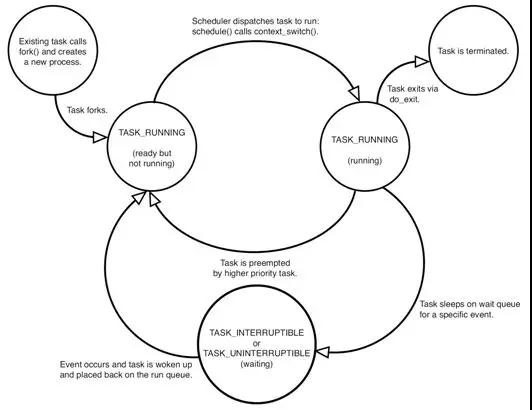

在Linux系统中，执行top命令或者uptime命令会出现一项load average的统计值，要理解load average统计值的含义，首先需要理解进程的几种状态。  
### 进程状态

 - TASK_RUNNING：进程处于运行（已获得cpu）或者准备运行（万事俱备，只欠东风，其它条件都获得只是没有分配cpu）；

 - TASK_INTERRUPTIBLE：可中断睡眠状态，可被中断或者信号唤醒；

 - TASK_UNINTERRUPTIBLE：不可中断睡眠状态，不可被中断或者信号唤醒；

 - TASK_STOPPED：进程暂停，进程收到SIGSTOP、SIGTSTP等信号会进入此状态；
 - ASK_TRACED：进程执行被调试器停止；
 - EXIT_ZOMBIE：进程处于僵尸状态，进程已经停止但是其父进程没有调用wait或waitpid回收其状态的进程会处于此状态；
 - EXIT_DEAD：进程的最终状态，进程已经停止其父进程也调用wait或waitpid回收其状态的进程。
### 认识load average
有了上面的认识，现在来理解load average就会容易多了，在Linux执行top(或者uptime)命令就会出现这项性能指标。  
11:13:07 up 3 days, 18:42,  2 users,  load average: 1.12, 1.05, 0.95  
load average后面三个数分别代表不同时间段的系统平均负载（一分钟、五 分钟、以及十五分钟），如上所示，这台机器1/5/15分钟的平均负载分别是0.48/0.57/0.78.  

在Linux下，系统平均负载指的是运行队列平均长度，也就是等待cpu的平均进程数。影响load average大小的直接因素是系统中活动的进程数目，也就是处于TASK_RUNNING和TASK_UNINTERRUPTIBLE状态的进程。

在利用load average进行系统性能评估的时候,是如何进行评估判断的，下面是一个可以供参考的准则(假设机器是单核)，具体根据自己项目业务看情况而定:  
 - Load < 0.7：系统很闲，可以考虑多部署一些服务；
 - 0.7 < Load < 1：系统状态不错；
 - Load == 1：系统马上要处理不过来了，赶紧找一下原因；
 - Load > 5：系统已经非常繁忙了；