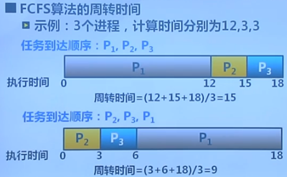
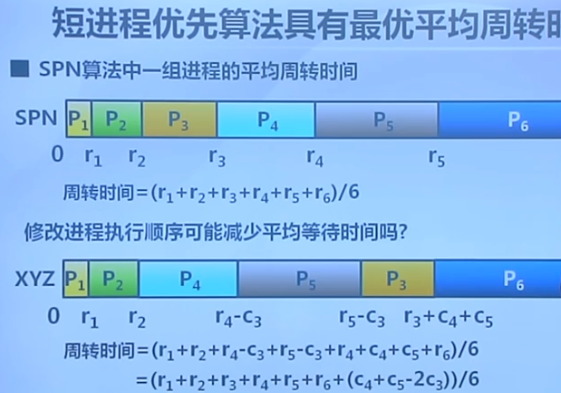
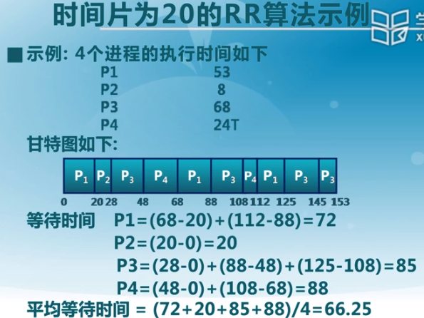
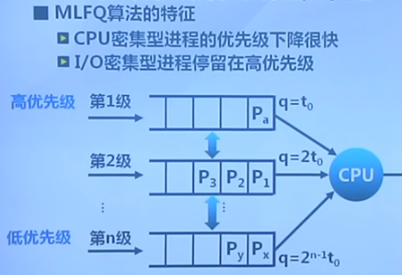
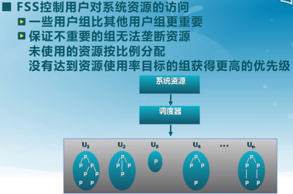
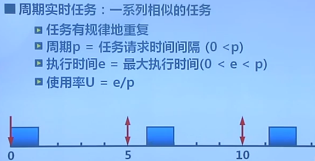
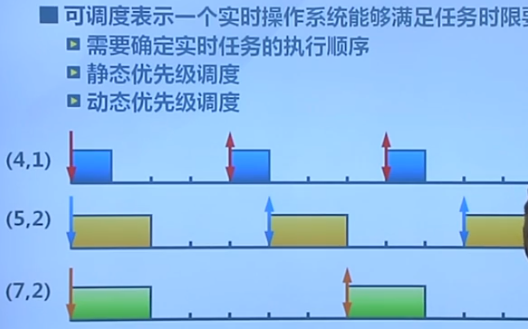

## 处理及调度

周转时间：进程从进入系统到完成的总时间。

### 算法

- 先来先服务：
  - 思想：根据进程进入就绪队列的先后顺序排序，当进程进入等待/结束状态时，选择就绪队列的下一个进程运行。
  - 
  - 优点：简单
  - 缺点：
    - 平均等待时间波动大，短进程可能排在长进程后面
    - I/O资源和CPU资源利用效率低：前面长时间CPU计算，导致后面IO需要等待。
- 短进程优先算法SPN：有最短的平均周转时间
  - 在就绪队列中选择执行时间最短进程来占用CPU，需要预测进程执行时间。
  - 最短剩余优先：若来了新的进程，其时间比当前正在执行的进程的剩余时间还长，则让新进程执行。
  - 
  - 缺点：连续的短进程导致长进程饥饿。需要预测程序执行时间。有公式拟合。
- 最高响应比优先算法HRRN：
  - 选择响应比R最高的进程执行：R=（等待时间 + 预估执行时间）/ 预估执行时间。即等待时间越长，优先级越高。
  - 不可抢占、关注进程的等待时间、防饥饿

其余：

- 时间片轮转算法RR， Round-Robin：
  - 时间片结束时，按照FCFS算法切换到下一个就绪进程
  - 
  - 会有额外的上下文切换开销，因为别的算法直到算法结束/等待时才切换。
  - 时间片太长：等待时间过长，极限情况下退化成FCFS先来先服务。
  - 时间片太端：大量的上下文切换，影响系统吞吐量。
  - 经验选择：让上下文切换开销占1%左右。10ms的时间片。
- 多级队列调度算法：
  - 将就绪队列划分为多个独立的子队列，如前台交互、后台批处理。每个队列有自己的调度策略。
  - 队列间的调度：
    - 固定优先级：先处理前台、后处理后台，可能导致饥饿。
    - 时间片轮转：每个队列都能得到一定比例的时间片。前台80%、后台20%，放置饥饿。
    - 但队列之间没有交互
  - 多级反馈队列算法MLFQ：
    - 进程可在不同队列之间移动
      - 优先级越高，时间片越小。
      - 执行时间越长(在当前时间片中没有完成)，则降到下一个优先级队列中。
      - 
    - 特征：
      - CPU密集型进程的优先级下降很快
      - I/O密集型进程停留在高优先级
  - 公平共享调度算法Fair Share Scheduling:
    - 控制用户对系统资源的访问，统计已使用的资源，没有用的资源按照比例分，之前没有使用完已分配资源的组获得更到的优先级。
    - 

总结：

- 先来先服务：不公平、简单、平均等待时间很大
- 短进程优先：不公平、平均周转时间最小、需要精确预测计算时间、饥饿
- 高响应比优先：基于短进程优先算法，考虑到进程等待时间，不可抢占
- 时间片轮转：公平、平均等待时间较差、交互性好
- 多级反馈队列：多个队列、每个队列有自己的调度算法、进程可在队列间移动
- 公平共享：公平是第一指标

### 实时调度

硬实时、软实时

### 多处理及调度

对称多处理器调度：每个处理器运行自己的调度程序、调度程序对共享资源的访问需要进行同步。

### 优先级反置 priority Inversion

在基于优先级的可抢占调度算法中：高优先级进程长时间等待低优先级进程所占用资源的现象。

解决方案：

1. 优先级继承priority inheritance.**只有占用资源的低优先级进程被阻塞时**，才提高占用资源进程的优先级，释放资源后，又降回原来的优先级。
2. 优先级天花板协议 priority ceiling protocol. 占用资源进程的优先级和所有可能申请该资源的最高优先级相同。不管是否发生等待，都提升占用资源进程的优先级。此时执行临界区资源时不会被阻塞。

