## 信号量与管程

信号量是操作系统提供的一种协调共享资源访问的方法

信号量：有一个整形sem变量(代表资源数量)和两个原子操作组成。

- 获取：P()(Prolaag): sem减1，若sem<0则等待
- 释放：V()(Verhoog): sem加1，如果sem<=0,则唤醒一个等待进程

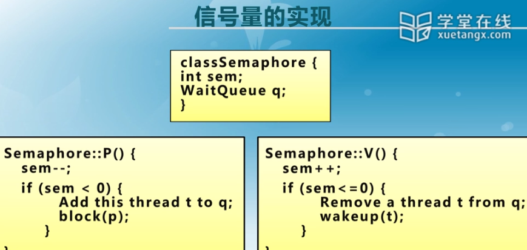

用信号量来解决生产者/消费者问题：

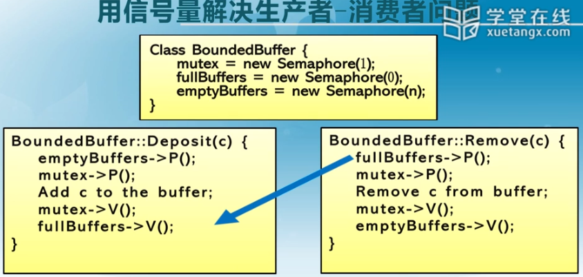

开发难度大，容易出错，不能够避免死锁问题。

## 管程

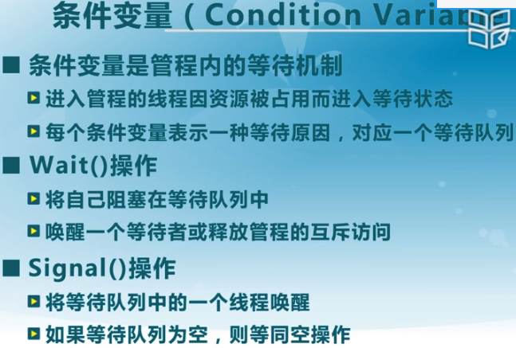

实现

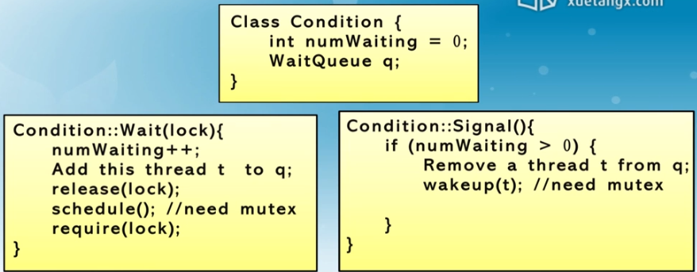

生产者/消费者：

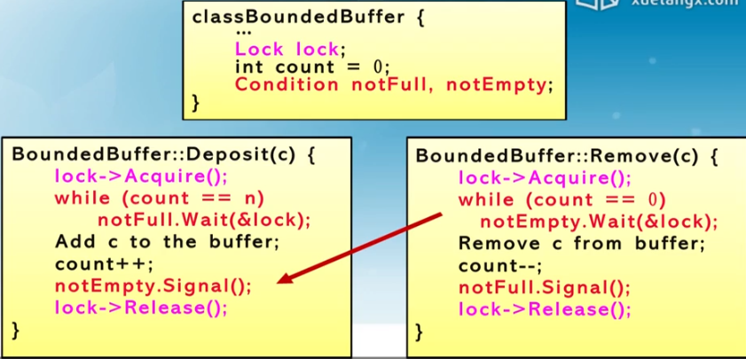

与信号量不同，当管程获取不到资源时，可以先放弃lock，让别的线程去获取锁。

两种不同的处理方式：

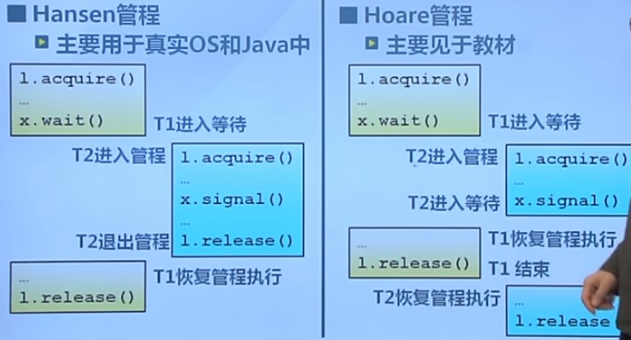

Hansen效率高，因为比Hoare少了上下文切换。但行为确定性上来讲，Hoare更加正确。

Hansen的signal只是一个提示，回来需要自己重新去判断，所以当前执行的现场优先级更高。

Hoare的signal表示条件变量的释放同时放弃管程的访问，所以等待条件变量的线程优先级更高。

具体的实现差异：

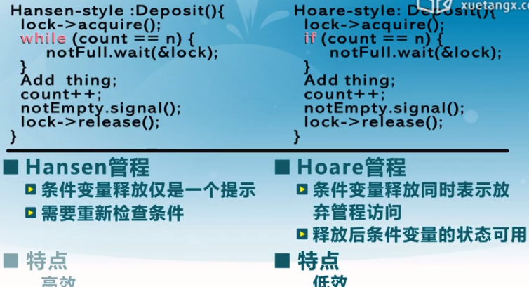

### 哲学家就餐问题

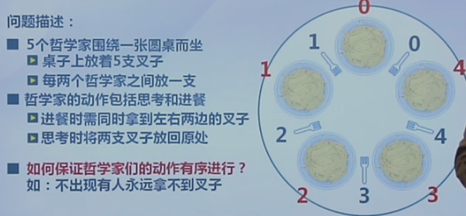

1.采用信号量：不正确，会导致死锁(同时拿起右边的)

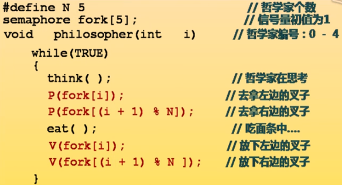

2. 采用互斥量：正确，但并发低，同时只能有一个人吃

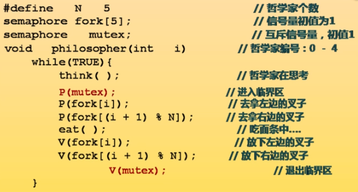

3.根据编号来判断先拿刀还是先拿叉。正确，两个人可同时就餐

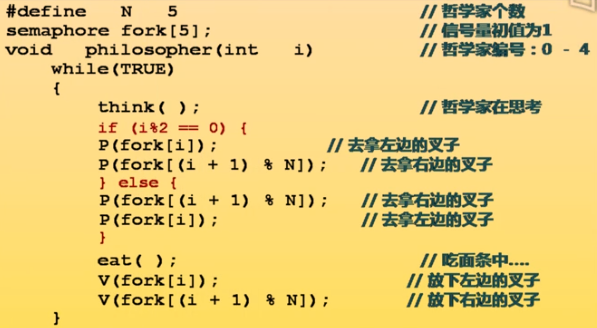