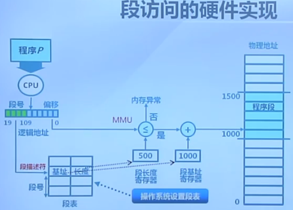
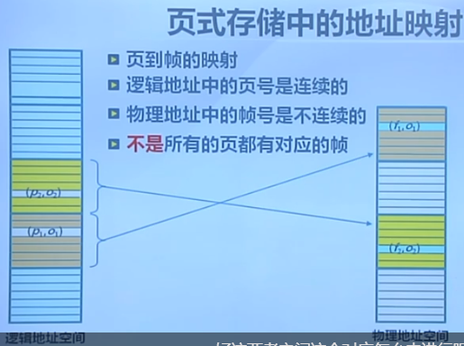
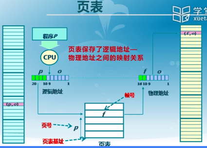
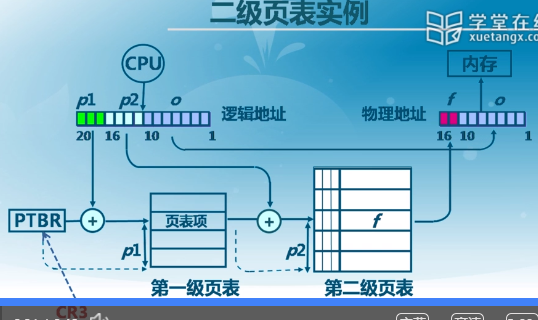
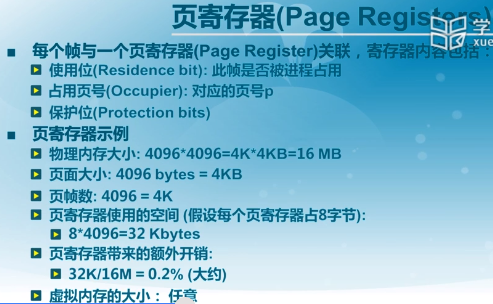
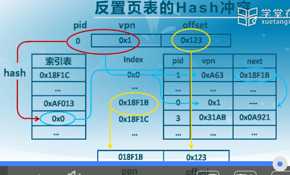
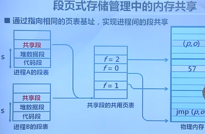

## 非连续内存分配

页：

页表：

页表基址寄存器PTBR存放了页表在内存中的起始地址。

逻辑地址中的页号 与 物理地址中的帧号 通过 页表 对应起来。

页表中的内容会随着程序的变化而动态变化。

页表项内容：

- 帧号
- 页表项标志
  - 存在位 resident bit：逻辑地址的页号是否有物理地址帧号对应
  - 修改位 dirty bit：是否修改
  - 引用位 过去某一段时间是否引用过该地址

问题：

快表TLB：缓存近期访问过的页表项

多级页表：

第一级页表起始地址放在CR3寄存器中

在第一级页表中通过p1查找到要使用的第二级页表，

在第二级页表中通过p2查找到要使用的第三级页表，

在第三级页表中通过p3查找到具体的物理地址的页帧号，最后通过偏移o访问物理地址。

二级页表举例：

对于大地址空间(64 bits)，多级页表将变得繁琐。

在多级页表中，每个逻辑地址对应一个页表项，当程序增加，使用的逻辑地址增加时，页表项也会相应增加，导致繁琐。那么，能不能页表项对应的是物理地址空间，而不是逻辑地址空间？这样页表项只是随着物理地址空间的使用而变化。因为逻辑地址空间的增长速度快于物理地址空间。页寄存器和反置页面就是这样的思路。

多级页表查找物理内存思路：逻辑地址->页表项->物理地址

现在页表项中存得是物理帧信息，cpu如何根据逻辑地址找到物理地址？

多逻辑地址进行hash映射，以减少搜索范围。

反置页表在页寄存器的基础上，将进程id也考虑进来：

段式存储：在内存保护方面有优势

页式存储：在内存利用和页面置换方面有优势

段页式可以很方便地实现内存共享，即指向相同的段

