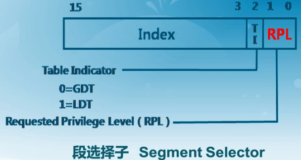
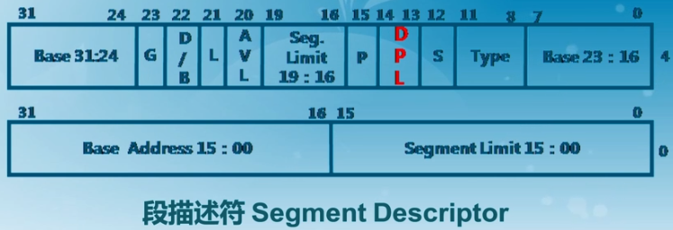
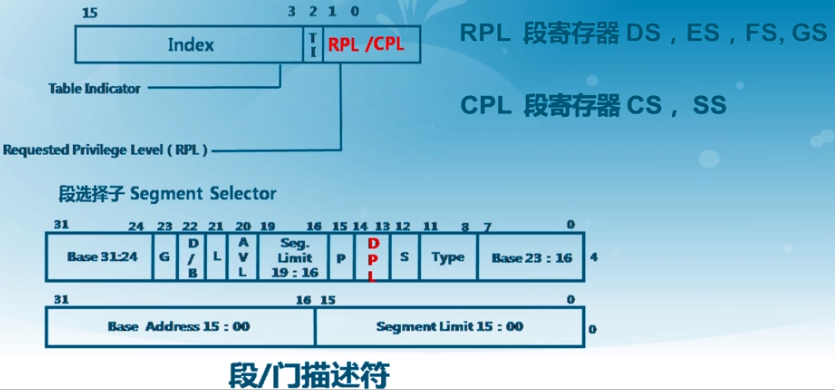
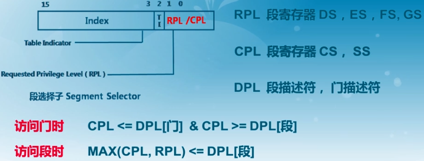
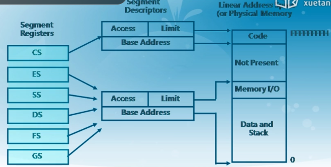

## 实验二 物理内存管理

cpu在如下时刻会检查特权级别：

- 访问数据段
- 访问页
- 进入中断服务例程

段选择子：位于段寄存器中。

代码在代码段中，数据在数据段中。一条指令的执行，需要访问代码段和数据段。

段描述符：

 RPL/CPL

- CPL是当前进程的权限级别(Current Privilege Level)，是当前正在执行的代码所在的段的特权级，存在于cs寄存器的低两位。
- DPL存储在段描述符中，规定访问该段的权限级别(Descriptor Privilege Level)，每个段的DPL固定。
- RPL说明的是进程对段访问的请求权限(Request Privilege Level)，是对于段选择子而言的，每个段选择子有自己的RPL，它说明的是进程对段访问的请求权限，有点像函数参数。而且RPL对每个段来说不是固定的，两次访问同一段时的RPL可以不同。RPL可能会削弱CPL的作用，例如当前CPL=0的进程要访问一个数据段，它把段选择符中的RPL设为3，这样虽然它对该段仍然只有特权为3的访问权限。

当进程访问一个段时，需要进程特权级检查，一般要求DPL >= max {CPL, RPL}

访问门时，可以切换到更高的特权级别，即中断、陷入、异常。首先要通过门，然后去访问特权更高的段。

段机制：

段寄存器中有index，通过index索引来找到全局描述符表GDT(可以理解为一个大的数组)中的一个项，该项就是一个段描述符，在段描述符中找到Base Address，再加上作为offset的EIP作为最终的线性地址。

通过段描述符来简历映射关系，段描述符中的重点是一个基地址Base Address和该段的限制limit。

GDT存在内存中，每一次访问地址，都会先去访问GDT表（段表），明显慢于CPU，那如何加快速度？