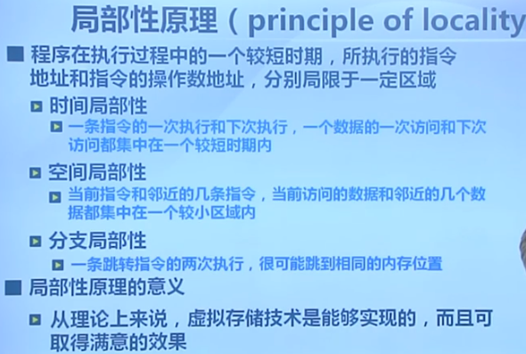
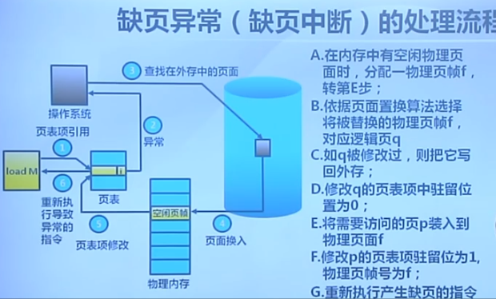
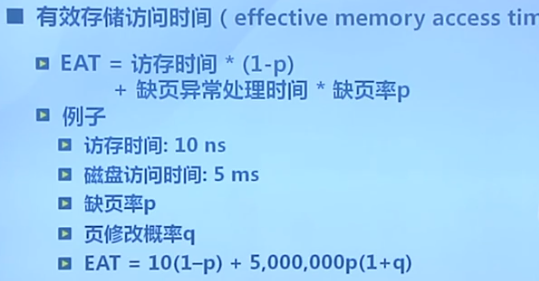

## 虚拟存储概念

### 覆盖技术

在较小的内存中运行较大的程序。

做法：在进程内，将程序划分为若干个相互独立的模块，将不会同时执行的模块共享统一内存区域。

常用的代码和数据放入常驻内存，不常用的代码则进行交换。

难点：需要程序员自己维护。

## 交换技术

增加正在运行或需要运行的程序的内存

做法：将暂时不用的程程序放到外存中。

- 交换时机：只有当内存不够时发生交换
- 交换区大小：以进程为单位，交换到外存。
- 程序换入时的重定位：动态地址映射

## 局部性原理

### 虚拟页式存储管理

虚拟页式页表项：

- 驻留位：表示该页是否在内存
- 修改位：该页在内存中是否被修改过
- 访问位：该页是否被访问过
- 保护位：只读、可读可写、可执行等
- 高度缓存是否有效：
- 用户态标志：

### 缺页异常

要将什么放入交换空间：除了代码段(可执行的二进制文件)、动态加载的共享库之外的数据段、堆栈段等等。

性能评价：

