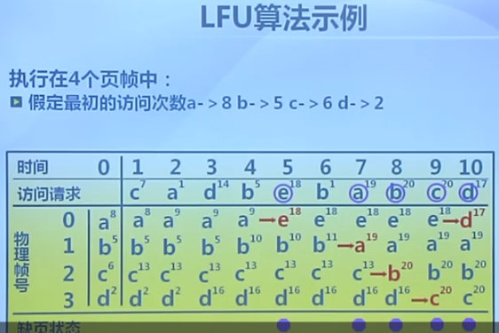
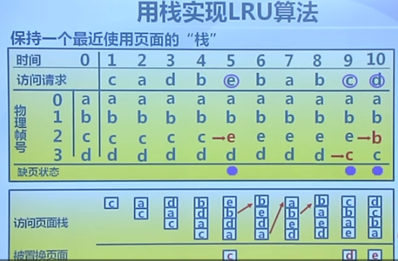
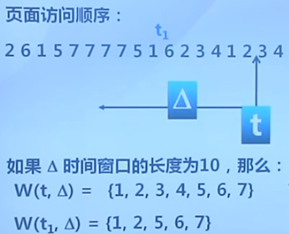
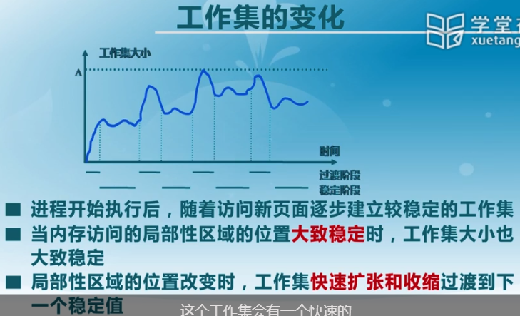

## 页面置换算法

功能：当出现缺页异常时，选择被置换的物理页面。

目标：尽可能减少页面置换次数，把近期可能不会访问的页面换出。

页面锁定：在页表项中的标志，操作系统、重要的页不会被置换出去。

评价标准：缺页次数越少越好。

### 局部页面置换算法：只在进程内部

- 最优算法：提前知道未来用什么页面，最优，但不现实。及选择未来最后需要访问的页面置换出去。
- 先进先出：选择在内存中驻留时间最长的页面进行置换。链表元素按照内存驻留时间排序，最长的在首，新页面在尾。
- 最近最久未使用算法LRU:选择最长时间没有被用的页面进行置换。最近访问的在链表首，选择链表尾置换。缺点是访问的时候开销大。
  - 时钟算法：针对LRU的统计过于详细，开销太大，时钟算法只做粗略统计。在FIFO和LRU中做折中。
    - 思想：页面装入内存，在页表项的访问位初始化为0，代表没有访问过。在访问该页时，将访问位置1，代表访问过。内存中的页组织成循环链表的方式。当发生缺页异常时，即要访问的页不在内存中，就在循环链表中网下扫描：1，若访问位为1，说明最近被访问过，就不置换，将访问位重新置0，指针向下继续扫描；2，若访问为为0，说明最近没有被访问过，则进行置换，并访问。
    - 如下图所示：访问页面在内存中，直接将访问位置1；不在内存，则从当前指针开始向下扫描，发现0、3、1、7页号最近都访问过，只有页号4的访问位为0，则置换页号4.
    - 
    - 缺点：如果置换的页被修改过，则需要先将修改过的页写回磁盘，然后再将新的页读进内存。
  - 改进的clock算法：减少修改页的缺页处理开销。
    - 在页表项中增加修改位，修改时进行标记，当发送缺页时，跳过有修改的页面。
    - 扫描之后，后续需要写入磁盘的可能会被合并写入？
  - 最不常用算法：相比LRU统计时间，LFU统计访问次数，缺页时置换访问计数最小的页面。
    - 计数大时，计数器定期右移。
    - 开销大。当切换到新的程序时，原来访问次数非常多的页会停留很长时间，浪费。
    - 
    - 

belady现象：缺页率太大时，增加物理页面，缺页率会变少么？

- FIFO算法，缺页率反而会增加
  - 原因：FIFO的置换算法的特征和进程访问内存的动态特征矛盾。被置换出去的页不一定不访问。
- LRU没有belady现象

比较：

- FIFO：根据页面进入时间排序，无须动态调整。性能低，开销少，有belady现象。

- LRU： 根据页面最近访问时间排序，动态调整，所有页面只访问一次时，退化为FIFO。
- clock时钟算法：折中。页面访问时，不用动态调整，仅做标记。缺页时跳过某些页，可以看作动态调整。

### 全局页面置换算法（考虑到进程间页面需求的差异性）

工作集：

实例：

- 工作集算法
- 缺页率算法

