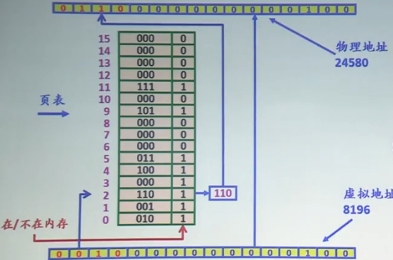
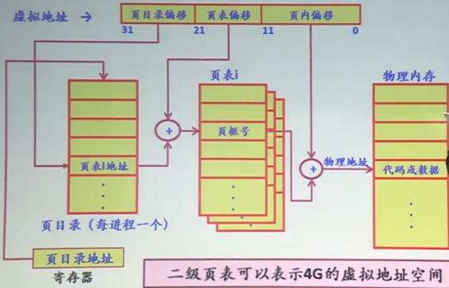
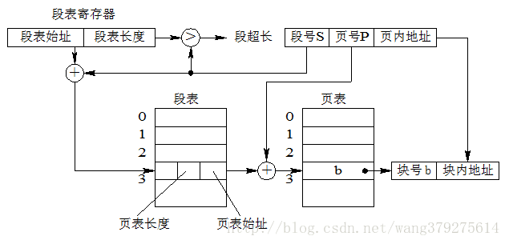
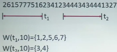
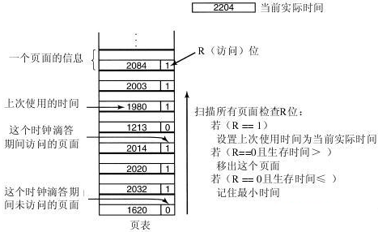

# 内存存储模型

要解决的问题：如何将多个进程地址(内核、用户)加载到物理内存中，并合理使用内存。

32位的系统总线是32位，最大只能寻址到4G。

**地址重定位/地址映射**：将进程地址 转为 物理地址。 逻辑地址为相对地址。

- 静态重定位：程序加载到内存时，一次性实现地址转换。一般由软件完成。
- 动态重定位：指令执行时进程地址转换。需要硬件支持，即内存管理单元MMU。

空闲内存管理：等长划分(bitmap), 不等长划分(空闲表、已分配表)

内存分配算法：首次适配、下次适配、最佳适配(满足最小)、最差适配(满足最大)

- **首次适应算法（First Fit）**：从空闲分区链首开始查找，找到第一个能满足其大小要求的空闲分区。

  **特点**： 该算法倾向于使用内存中低地址部分的空闲区，在高地址部分的空闲区很少被利用，从而保留了高地址部分的大空闲区。显然为以后到达的大作业分配大的内存空间创造了条件。

  缺点：低地址部分不断被划分，留下许多难以利用、很小的空闲区，而每次查找又都从低地址部分开始，会增加查找的开销。

- **循环首次适应算法（Next Fit）**：从上一次找到的空闲区接着找，直至找到一个能满足要求的空闲分区，并从中划出一块来分给作业。

  **特点**：使内存中的空闲分区分布的更为均匀，减少了查找时的系统开销。

  缺点：缺乏大的空闲分区，从而导致不能装入大型作业。

- **最佳适应算法（Best Fit）**：该算法总是把既能满足要求，又是最小的空闲分区分配给作业。为了加速查找，该算法要求将所有的空闲区按其大小排序后，以递增顺序形成一个空白链。这样每次找到的第一个满足要求的空闲区，必然是最优的。孤立地看，该算法似乎是最优的，但事实上并不一定。因为每次分配后剩余的空间一定是最小的，在存储器中将留下许多难以利用的小空闲区。同时每次分配后必须重新排序，这也带来了一定的开销。

  **特点**：每次分配给文件的都是最合适该文件大小的分区。

  缺点：内存中留下许多难以利用的小的空闲区。

- **最坏适应算法(Worst Fit)**：该算法按大小递减的顺序形成空闲区链，分配时直接从空闲区链的第一个空闲区中分配（不能满足需要则不分配）。很显然，如果第一个空闲分区不能满足，那么再没有空闲分区能满足需要。这种分配方法初看起来不太合理，但它也有很强的直观吸引力：在大空闲区中放入程序后，剩下的空闲区常常也很大，于是还能装下一个较大的新程序。

  最坏适应算法与最佳适应算法的排序正好相反，它的队列指针总是指向最大的空闲区，在进行分配时，总是从最大的空闲区开始查寻。

  该算法克服了最佳适应算法留下的许多小的碎片的不足，但保留大的空闲区的可能性减小了，而且空闲区回收也和最佳适应算法一样复杂。

  **特点**：给文件分配分区后剩下的空闲区不至于太小，产生碎片的几率最小，对中小型文件分配分区操作有利。

  缺点：使存储器中缺乏大的空闲区，对大型文件的分区分配不利。

内存回收算法：上相邻、下相邻、上下都相邻、上下都不相邻的空闲区进行合并

## 伙伴系统

linux采用的经典的内存分配方案：将内存按2的幂进程划分，组成若干空闲块链表。每次对半分，如果还有空闲的，继续对半分。回收时，如果能够合并，则可以合并(必须为2的幂次)。

一个进程进入内存中若干个不连续的区域。

## １．页式存储方案

### 1.1 内容

设计思想：用户进程地址空间被划分为大小相等的部分，称为页，从0开始编号；内存空间按同样大小分为大小相等的区域，称为页框，从0开始编号。通过页表进行映射。为方便地址转换，页面大小应是2的整数幂.

内存分配规则：以页为单位进行分配，逻辑上相邻的页，物理上不一定相邻。典型尺寸：4K 或 4M

逻辑地址：页号 + 页内地址/页偏移（系统自动划分）

  

　

页表(硬件支持)：

- 页表项：记录了逻辑页号与页框号的对应关系。以及读写权限。

- 每个进程一个页表，放在内存

  

  **内存管理单元依赖于页表来进行一切与页面有关的管理活动**，这些活动包括判断某一页面号是否在内存里，页面是否受到保护，页面是否非法空间等等。

空闲内存管理：位图bitmap

### 1.2 优缺点

**优点：**

- （1）分页系统不会产生外部碎片，一个进程占用的内存空间可以不是连续的，并且一个进程的虚拟页面在不需要的时候可以放在磁盘中。
  （2）分页系统可以共享小的地址，即页面共享。只需要在对应给定页面的页表项里做一个相关的记录即可。	

**缺点：** 页内碎片。　页表很大，占用了大量的内存空间。

### 1.3 缺页中断处理

　　在分页系统中，一个虚拟页面既有可能在物理内存，也有可能保存在磁盘上。**如果CPU发出的虚拟地址对应的页面不在物理内存，就将产生一个缺页中断，而缺页中断服务程序负责将需要的虚拟页面找到并加载到内存**。缺页中断的处理步骤如下，省略了中间很多的步骤，只保留最核心的几个步骤：

### 1.4 页面置换算法

　　如果发生了缺页异常，就需要从磁盘上将需要的页面调入内存。如果内存没有多余的空间，就需要在现有的页面中选择一个页面进行替换。使用不同的页面置换算法，页面更换的顺序也会各不相同。如果挑选的页面是之后很快又要被访问的页面，那么系统将很开再次产生缺页异常，因为磁盘访问速度远远内存访问速度，缺页异常的代价是非常大的。因此，挑选哪个页面进行置换不是随随便便的事情，而是有要求的。

## ２．段式存储管理方案

设计思想：用户进程地址空间中，按照自身的逻辑关系划分为若干个程序段，每个程序段都有一个段名。

### 2.1 内容

分段管理就是**将一个程序按照逻辑单元分成多个程序段，每一个段使用自己单独的虚拟地址空间**。例如，对于编译器来说，我们可以给其5个段，占用5个虚拟地址空间，如下图所示：

内存空间被动态地划分为若干个长度不相同的区域，为物理段，由起始地址和长度决定。短号+段内地址(不是系统划分,需要显示支出)

内存分配：以段为单位进行分配，每段在内存中占连续空间，但各段之间可以不连续

### 2.2 优缺点

**优点：**

　　（1）每个逻辑单元可单独占用一个虚拟地址空间，这样使得编写程序的空间大为增长。

　　（2）由于段式按逻辑关系划分，因此共享起来十分方便。

　　（3）对于空间稀疏的程序来说，分段管理将节省大量的空间。

**缺点：**

　　（1）外部碎片和一个段必须全部加载到内存。

## ３．页式和段式的区别

　　页式和段式系统有许多相似之处。比如，两者都采用离散分配方式，且都通过地址映射机构来实现地址变换。但概念上两者也有很多区别，主要表现在：

1)、**需求**：是信息的物理单位，分页是为了实现离散分配方式，以减少内存的碎片，提高内存的利用率。或者说，分页仅仅是由于系统管理的需要，而不是用户的需要。段是信息的逻辑单位，它含有一组其意义相对完整的信息。分段的目的是为了更好地满足用户的需要。

​    一条指令或一个操作数可能会跨越两个页的分界处，而不会跨越两个段的分界处。

2)、**大小**：页大小固定且由系统决定，把逻辑地址划分为页号和页内地址两部分，是由机器硬件实现的。段的长度不固定，且决定于用户所编写的程序，通常由编译系统在对源程序进行编译时根据信息的性质来划分。

3)、逻辑地址表示：页式系统地址空间是**一维**的，即单一的线性地址空间，程序员只需利用一个标识符，即可表示一个地址，因为分页大小固定，页码之间连续，故给出一个地址就可计算其页码和偏移地址。分段的作业地址空间是**二维**的，程序员在标识一个地址时，既需给出段名，又需给出段内地址。

4)、比页大，因而段表比页表短，可以缩短查找时间，提高**访问速度**。

## ４．段页式存储管理方案

用户进程：先按段划分，每一段再按页划分。 段号 + 段内地址(页号+ 页内地址)

内存划分：同页式存储方案，以页为单位进程分配

### 3.1 内容

　　段页式管理就是**将程序分为多个逻辑段，在每个段里面又进行分页，即将分段和分页组合起来使用**。这样做的目的就是想同时获得分段和分页的好处，但又避免了单独分段或单独分页的缺陷。

　　采用多级页表，顶级为段表，次级为页表。由段号在段表里面获得所应该使用的页表，然后在该页表里面查找物理页面号，如下图所示：

 

### 3.2 具体实现步骤

请看上图，给出逻辑地址的段号、页号、页内地址，开始进行地址变换：

1) 在被调进程的PCB中取出段表始址和段表长度，装入段表寄存器

2) 段号与控制寄存器的页表长度比较，若页号大于等于段表长度，发生地址越界中断，停止调用，否则继续

3) 由段号结合段表始址求出页表始址和页表大小

4) 页号与段表的页表大小比较，若页号大于等于页表大小，发生地址越界中断，停止调用，否则继续

5) 由页表始址结合段内页号求出存储块号

6) 存储块号&页内地址，即得物理地址

注意：在页式、段式存储管理中，为获得一条指令或数据，须两次访问内存；而段页式则须三次访问内存

如何加快地址转换：引入高速缓存的块表TLB

## ５．内存管理演变

　　（1）一开始，人们根据直觉，将一个程序作为一整段进行管理，从而形成了纯粹分段（固定加载地址、固定分区、非固定分区、交换）管理模式，也称为[基本内存管理](http://www.cnblogs.com/edisonchou/p/5090315.html)模式，这种模式由于直观易实现，曾经大为流行。

　　（2）但是，纯粹分段存在重大缺陷（由于此种模式下一个程序只有一段，从而导致内存空间增长困难，外部碎片、程序不能超过物理内存容量、一个程序必须同时加载到内存才能执行等缺点），为了克服这些缺点，引入了[页式内存管理](http://www.cnblogs.com/edisonchou/p/5094066.html)模式。

　　（3）显然，页式内存管理克服了纯粹分段的一系列缺点，但又存在共享不方便、一个程序只能在一个徐地址空间增长的问题，为了解决这个问题，引入了逻辑分段。逻辑分段将一个程序按逻辑关系分解为多个段，从而扩大了程序可以使用的虚拟地址空间并解决了共享难的问题。

　　（4）但是，逻辑分段终究还是分段，自然又引入了分段的缺点。而要客服这些缺点，自然又想到了分页。这样，人们又引入了段页式管理模式。

　　因此，内存管理模式经历了从纯粹分段到分页，再到逻辑分段，再到段内分页的演变过程，如上图所示.

## ６．交换技术

覆盖技术：程序员自己完成设计。

交换技术：在内存与磁盘之间动态调度。

交换内容：运行时创建或修改的内容：栈和堆

交换区：由操作系统直接管理。

交换时机：不用时，内存不足时

不应该换出处于等待IO操作的进程

### 6.1 页面置换算法

目标：**降低随后发生缺页中断的次数或概率**。

#### 6.1.1 随机更换算法

#### 6.1.2 先进先出算法 FIFO

　　链表：按进入内存时间，先进先出

#### 6.1.3 第二次机会算法

　　链表：进入内存时间＋最近是否被访问。如果被访问过，就将进入内存时间修改为当前时间，访问位清零。

#### 6.1.4 时钟算法

　　环形，使用指针，＋　最近是否被访问

#### 6.1.5 最优更换算法

#### 6.1.6 最近未被使用算法NRU

　　访问位R、修改位M。在编号最小的一类中随机选择一页。

#### 6.1.7 最近最少使用算法LRU

　　选择最后一次访问时间距离当前时间最长的一页，需要时间信息，开销比较大。(老化算法？)

#### 6.1.8 最近最不经常使用算法NFU

  可改为访问次数最少。

#### 6.1.9 工作集算法

　　工作集W,进程在过去某个单位时间访问到的页面的集合。

　　基本思路：找出一个不在工作集中的页面并置换它

　　该算法工作方式如下。假定使用硬件来置R位和M位。同样，假定在每个时钟滴答中，有一个定期的时钟中断会用软件方法来清除R位。每当缺页中断发生时，扫描页表以找出一个合适的页面淘汰之。

　　在处理每个表项时，都需要检查R位。如果它是1，就把当前实际时间写进页表项的“上次使用时间”域，以表示缺页中断发生时该页面正在被使用。既然该页面在当前时钟滴答中已经被访问过，那么很明显它应该出现在工作集中，并且不应该被删除（假定t横跨多个时钟滴答）。

　　如果R是0，那么表示在当前时钟滴答中，该页面还没有被访问过，则它就可以作为候选者被置换。为了知道它是否应该被置换，需要计算它的生存时间（即当前实际运行时间减去上次使用时间），然后与t做比较。如果它的生存时间大于t，那么这个页面就不再在工作集中，而用新的页面置换它。扫描会继续进行以更新剩余的表项。

　　然而，如果R是0同时生存时间小于或等于t，则该页面仍然在工作集中。这样就要把该页面临时保留下来，但是要记录生存时间最长（“上次使用时间”的最小值）的页面。如果扫描完整个页表却没有找到适合被淘汰的页面，也就意味着所有的页面都在工作集中。在这种情况下，如果找到了一个或者多个R＝0的页面，就淘汰生存时间最长的页面。在最坏情况下，在当前时间滴答中，所有的页面都被访问过了（也就是都有R＝1），因此就随机选择一个页面淘汰，如果有的话最好选一个干净页面。

　　**缺点**：开销很大。  

#### 6.1.10 工作集时钟算法

参考：

[1].http://www.cnblogs.com/edisonchou/p/5094066.html

[2].https://blog.csdn.net/liying_1234/article/details/52053183