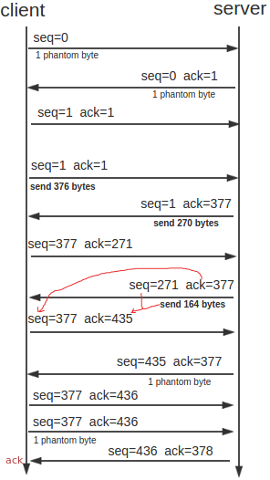

## TCP

参考:[《TCP/IP详解　卷１:协议》在线阅读](http://www.52im.net/topic-tcpipvol1.html)

TCP提供一种面向连接的、可靠的字节流服务。

TCP通过下列方式来提供可靠性：

1. **确定报文段大小**：应用数据被分割成TCP认为最适合发送的数据块。这和UDP完全不同，应用程序产生的数据报长度将保持不变。由TCP传递给IP的信息单位称为报文段或段（segment)。在18.4节我们将看到TCP如何确定报文段的长度。
2. **超时重传**：当TCP发出一个段后，它启动一个定时器，等待目的端确认收到这个报文段。如果不能及时收到一个确认，将重发这个报文段。在第21章我们将了解TCP协议中自适应的超时及重传策略。
3. **延迟接收**：当TCP收到发自TCP连接另一端的数据，它将发送一个确认。这个确认不是立即发送，通常将推迟几分之一秒，这将在19.3节讨论。
4. **校验数据**：TCP将保持它首部和数据的检验和。这是一个端到端的检验和，目的是检测数据在传输过程中的任何变化。如果收到段的检验和有差错，TCP将丢弃这个报文段和不确认收到此报文段（希望发端超时并重发）。
5. **重排序**：既然TCP报文段作为IP数据报来传输，而IP数据报的到达可能会失序，因此TCP报文段的到达也可能会失序。如果必要，TCP将对收到的数据进行重新排序，将收到的数据以正确的顺序交给应用层。
6. **重复**：既然IP数据报会发生重复，TCP的接收端必须丢弃重复的数据。
7. **流量控制**：TCP还能提供流量控制。TCP连接的每一方都有固定大小的缓冲空间。TCP的接收端只允许另一端发送接收端缓冲区所能接纳的数据。这将防止较快主机致使较慢主机的缓冲区溢出。窗口大小指明了对方可以连续发而不经过确认的最大报文数量。

前面还有14个字节的帧头：

**序号**：用来标识从TCP发端向TCP收端发送的数据字节流，它表示在这个报文段中的的第一个数据字节。如果将字节流看作在两个应用程序间的单向流动，则TCP用序号对每个字节进行计数。序号是32 bit的无符号数，序号到达232－1后又从0开始。

**ACK**:既然每个传输的字节都被计数，确认序号包含发送确认的一端所期望收到的下一个序号。因此，确认序号应当是上次已成功收到数据字节序号加1。只有ACK标志（下面介绍）为1时确认序号字段才有效。

TCP为应用层提供全双工服务。这意味数据能在两个方向上独立地进行传输。因此，连接的每一端必须保持每个方向上的传输数据序号。

**首部长度**给出首部中32 bit字的数目。需要这个值是因为任选字段的长度是可变的。这个字段占4bit，因此TCP最多有60字节的首部。然而，没有任选字段，正常的长度是20字节。

**流量控制**由连接的每一端通过声明的窗口大小来提供。窗口大小为字节数，起始于确认序号字段指明的值，这个值是接收端正期望接收的字节。

**检验和**覆盖了整个的TCP报文段：TCP首部和TCP数据。这是一个强制性的字段，一定是由发端计算和存储，并由收端进行验证。

只有当URG标志置1时**紧急指针**才有效。紧急指针是一个正的偏移量，和序号字段中的值相加表示紧急数据最后一个字节的序号。TCP的紧急方式是发送端向另一端发送紧急数据的一种方式。

以下具体过程可以参考：https://blog.csdn.net/tianyue168/article/details/5822042

**建立连接的3次握手**：

1. 请求端（通常称为客户）发送一个SYN段指明客户打算连接的服务器的端口，以及初始序号（ISN，在这个例子中为x）。
2. 服务器发回包含服务器的初始序号y的SYN报文段作为应答。同时，将确认序号设置为客户的ISN加1以对客户的SYN报文段进行确认。一个SYN将占用一个序号。
3. 客户必须将确认序号设置为服务器的ISN加1以对服务器的SYN报文段进行确认。

发送第一个SYN的一端将执行主动打开（active open）。接收这个SYN并发回下一个SYN的另一端执行被动打开（passive open）。初始序号ISN随时间而变化，因此每个连接都将具有不同的ISN。RFC 793[Postel 
1981c]指出ISN可看作是一个32比特的计数器，每4ms加1。这样选择序号的目的在于防止在网络中被延迟的分组在以后又被传送，而导致某个连接的一方对它作错误的解释。

**数据传输**：

1. 发送数据：服务器向客户端发送一个带有数据的数据包，该数据包中的序列号和确认号与建立连接第三步的数据包中的序列号和确认号相同；
2. 确认收到：客户端收到该数据包，向服务器发送一个确认数据包，该数据包中，序列号是为上一个数据包中的确认号值，而确认号为服务器发送的上一个数据包中的序列号+所该数据包中所带数据的大小。
   1. seq = 上次接收的包中的ack
   2. ack = 上次发送 数据包中（ seq + len(data)）
3. 序列号总结：
   1. seq = ISN + 累计发送量
   2. ack = IAN + 累计接收量

数据分段中的序列号可以保证所有传输的数据按照正常的次序进行重组，而且通过确认保证数据传输的完整性。

**连接终止的4次挥手协议**：

既然一个TCP连接是全双工（即数据在两个方向上能同时传递），因此每个方向必须单独地进行关闭。这原则就是当一方完成它的数据发送任务后就能发送一个FIN来终止这个方向连接。当一端收到一个FIN，它必须通知应用层另一端几经终止了那个方向的数据传送。收到一个FIN只意味着在这一方向上没有数据流动。一个TCP连接在收到一个FIN后仍能发送数据。

进行关闭的一方（即发送第一个FIN）将执行主动关闭，而另一方（收到这个FIN）执行被动关闭。通常一方完成主动关闭而另一方完成被动关闭。

1. TCP客户端发送一个FIN，用来关闭从客户到服务器的数据传送。
2. 当服务器收到这个FIN，它发回一个ACK，确认序号为收到的序号加1。和SYN一样，一个FIN将占用一个序号.
3. 同时TCP服务器还向应用程序（即丢弃服务器）传送一个文件结束符。接着这个服务器程序就关闭它的连接，导致它的TCP端发送一个FIN.
4. 客户必须发回一个确认，并将确认序号设置为收到序号加1.

**滑动窗口**：

简易视频：<http://v.youku.com/v_show/id_XNDg1NDUyMDUy.html>

参考文章：https://blog.csdn.net/wdscq1234/article/details/52444277

发送的每一个包都有一个id，接收端必须对每一个包进行确认，这样设备A一次多发送几个片段，而不必等候ACK，同时接收端也要告知它能够收多少，这样发送端发起来也有个限制，当然还需要保证顺序性，不要乱序，对于乱序的状况，我们可以允许等待一定情况下的乱序，比如说先缓存提前到的数据，然后去等待需要的数据，如果一定时间没来就DROP掉，来保证顺序性！

在TCP/IP协议栈中，滑动窗口的引入可以解决此问题，先来看从概念上数据分为哪些类

1. Sent and Acknowledged：这些数据表示已经发送成功并已经被确认的数据，比如图中的前31个bytes，这些数据其实的位置是在窗口之外了，因为窗口内顺序最低的被确认之后，要移除窗口，实际上是窗口进行合拢，同时打开接收新的带发送的数据
2. Send But Not Yet Acknowledged：这部分数据称为发送但没有被确认，数据被发送出去，没有收到接收端的ACK，认为并没有完成发送，这个属于窗口内的数据。
3. Not Sent，Recipient Ready to Receive：这部分是尽快发送的数据，这部分数据已经被加载到缓存中，也就是窗口中了，等待发送，其实这个窗口是完全有接收方告知的，接收方告知还是能够接受这些包，所以发送方需要尽快的发送这些包
4. Not Sent，Recipient Not Ready to Receive： 这些数据属于未发送，同时接收端也不允许发送的，因为这些数据已经超出了发送端所接收的范围

对于接收端也是有一个接收窗口的，类似发送端，接收端的数据有3个分类，因为接收端并不需要等待ACK所以它没有类似的接收并确认了的分类，情况如下

1. Received and ACK Not Send to Process：这部分数据属于接收了数据但是还没有被上层的应用程序接收，也是被缓存在窗口内
2. Received  Not ACK: 已经接收并，但是还没有回复ACK，这些包可能输属于Delay ACK的范畴了
3. Not Received：有空位，还没有被接收的数据。

发送窗口和可用窗口

对于发送方来讲，窗口内的包括两部分，就是发送窗口（已经发送了，但是没有收到ACK），可用窗口，接收端允许发送但是没有发送的那部分称为可用窗口。

1. Send Window ： 20个bytes 这部分值是有接收方在三次握手的时候进行通告的，同时在接收过程中也不断的通告可以发送的窗口大小，来进行适应
2. Window Already Sent: 已经发送的数据，但是并没有收到ACK。

原理：

TCP并不是每一个报文段都会回复ACK的，可能会对两个报文段发送一个ACK，也可能会对多个报文段发送1个ACK【**累计ACK**】，比如说发送方有1/2/3 3个报文段，先发送了2,3 两个报文段，但是接收方期望收到1报文段，这个时候2,3报文段就只能放在缓存中等待报文1的空洞被填上，如果报文1，一直不来，报文2/3也将被丢弃，如果报文1来了，那么会发送一个ACK对这3个报文进行一次确认。

举一个例子来说明一下滑动窗口的原理：

1. 假设32~45 这些数据，是上层Application发送给TCP的，TCP将其分成四个Segment来发往internet
2. seg1 32~34 seg3 35~36 seg3 37~41 seg4 42~45  这四个片段，依次发送出去，此时假设接收端之接收到了seg1 seg2 seg4
3. 此时接收端的行为是回复一个ACK包说明已经接收到了32~36的数据，并将seg4进行缓存（保证顺序，产生一个保存seg3 的hole）
4. 发送端收到ACK之后，就会将32~36的数据包从发送并没有确认切到发送已经确认，提出窗口，这个时候窗口向右移动
5. 假设接收端通告的Window Size仍然不变，此时窗口右移，产生一些新的空位，这些是接收端允许发送的范畴
6. 对于丢失的seg3，如果超过一定时间，TCP就会重新传送（重传机制），重传成功会seg3 seg4一块被确认，不成功，seg4也将被丢弃

就是不断重复着上述的过程，随着窗口不断滑动，将真个数据流发送到接收端，实际上接收端的Window Size通告也是会变化的，接收端根据这个值来确定何时及发送多少数据，从对数据流进行流控。原理图如下图所示：

总结一点，就是接收端可以根据自己的状况通告窗口大小，从而控制发送端的接收，进行流量控制