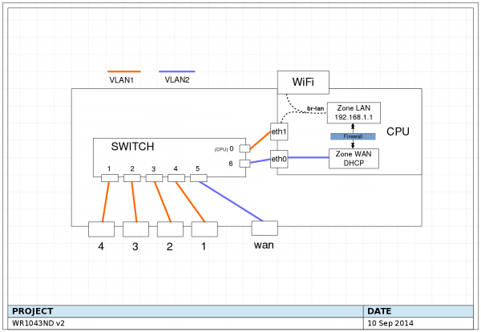

#  


OVS配置

**配置ovs交换机配置详细记录**___2017.11.22

 

openwrt官网下载固件的版本为15.05 (**注意**不是15.05.1，这个版本无法安装ovs)

​		进入使用ssh进入openwrt，使用命令opkg  update对openwrt更新，然后使用opkg  install openvswitch命令进行下载安装ovs到openwrt上，然后对network文件和wireless文件进行部分更改。(1043机器按照顺序编号为17 、18、 19) 

因为上层的骨干路由器的lan口作为网关，配置位192.168.2.1，DHCP的ip分配范围是192.168.2.100到192.168.2.199。所以在指定每一个三层交换机的wan口的时候指定成静态static的ip地址；例如18号机器就指定wan的ip为192.168.2.118,就不用上层的lan口来分配ip，这样为后面的远程ssh管理带来方便，后面记录开启远程ssh的方法。

​		

​	同时将每个交换机的lan口也设置成静态ip地址。例如18号机器就命名成192.168.1.18，方便记忆。而不是192.168.1.1.。

​	

​	统一将openwrt的登录密码为ylab。所有的 wifi信号的SSID都是openwrt_18_2.4(openwrt_18_5.0),暂时没有加密，因为wifi的连接诶如其实是192.168.2.1的lan口在分配ip地址。如果加密还有问题（加密后无法分配ip），没有解决。

 

**1、对openwrt的配置**

Tplink1043 #############################

对network更改：

```shell
	config interface 'loopback'

        option ifname 'lo'                                                      

        option proto 'static'                                                   

        option ipaddr '127.0.0.1'                                               

        option netmask '255.0.0.0'                                             

config globals 'globals'                                                              

		option ula_prefix 'fdeb:1395:c3c1::/48'                                 

config interface 'lan'                                                                 

		option ifname 'eth1.1'                                                      

		option force_link '1'                                                        

	    option type 'bridge'                                                    

		option proto 'static'                                                   

		option netmask '255.255.255.0'                                          

		option ip6assign '60'                                                   

		option ipaddr '192.168.1.18'               

	

config interface 'wan'                                                          

		option ifname 'eth0'                                                    

		option _orig_ifname 'eth0'                                              

		option _orig_bridge 'false'                                             

		option proto 'static'                                                   

		option ipaddr '192.168.2.118'                                           

		option netmask '255.255.255.0'                                          

		option gateway '192.168.2.1'                                            

		option dns '202.117.0.20 202.117.0.21'     

                                                                                

config interface 'wan6'                                                         

		option ifname 'eth0'                                                    

option proto 'dhcpv6'                                                   
                                                                   

config switch                                                                   

		option name 'switch0'                                                   

		option reset '1'                                                        

		option enable_vlan '1'                                                                

 

config switch_vlan                                                              

     option device 'switch0'                                                 

		option vlan '1'                                                         

		option ports '0t 3 4'                                                   

		option vid '1'                                                          

 

config switch_vlan                                                              

		option device 'switch0'                                                 

		option vlan '3'                                                         

		option ports '0t 1 2'                                                   

		option vid '3'                                                          

                                                                                

config interface                                                                

		option ifname 'eth1.3'                                                  

		option proto 'static'                                                  

 

config switch_vlan                                                              

		option device 'switch0'                                                 

		option vlan '2'                                                         

		option ports '5 6' 
```


​                                                                                                                   

\----------------------------------------------------------------------------------------

对wireles文件的更改

```shell
config wifi-device 'radio0'

		option type 'mac80211'

		option channel '11'

		option hwmode '11g'

		option path 'platform/qca955x_wmac'

		option htmode 'HT20'

 	option txpower '25'

		option country 'US'

 

config wifi-iface

		option device 'radio0'

\## option network 'lan'

		option mode 'ap'

		option encryption 'none'

		option ssid 'OpenWrt_18_2.4'
```


3800机器#############################

对network文件的更改

```
config interface 'loopback'                                                     

	option ifname 'lo'                                                      

	option proto 'static'                                                   

	option ipaddr '127.0.0.1'                                               

	option netmask '255.0.0.0'                                              

	

config globals 'globals'                                                        

 option ula_prefix 'fd15:5aba:1ead::/48'                                 

                                                                               

config interface 'lan'                                                          

	option ifname 'eth0.1'                                                  

	option force_link '1'                                                   

option type 'bridge'                                                    

	option proto 'static'                                                   

	option netmask '255.255.255.0'                                          

	option ip6assign '60'                                                   

	option ipaddr '192.168.1.16'                                            

config interface 'wan'                                                          

	option ifname 'eth1'                                                    

	option _orig_ifname 'eth1'                                              

	option _orig_bridge 'false'                                             

option proto 'static'                                                   

	option ipaddr '192.168.2.116'                                           

option netmask '255.255.255.0'                                          

	option gateway '192.168.2.1'                                            

	option dns '202.117.0.20 202.117.0.21'                                  

 

config interface 'wan6'                                             

	option ifname 'eth1'                                                    

	option proto 'dhcpv6'                                                   

 

config switch                                                                   

	option name 'switch0'                                                   

	option reset '1'                                                        

	option enable_vlan '1'                                                  

	option blinkrate '2'  

config switch_vlan                                                              

	option device 'switch0'                                                 

	option vlan '1'                                                         

	option ports '2 3 5t'                                                   

 

config switch_vlan                                                              

	option device 'switch0'                                                 

	option vlan '2'                                                         

	option ports '0 1 5t'                                                                                                                             

 

config interface                                                                

	option ifname 'eth0.2'                                                  

	option proto 'static'                                                   

 

config switch_port                                                              

	option device 'switch0'                                                 

	option port '1'                                                         

	option led '6'                                                                              

 

config switch_port                                                              

	option device 'switch0'                                                 

	option port '2'                                                         

	option led '9'     

 

config switch_port                                                              

	option device 'switch0'                                                 

	option port '5'                                                

	option led '2'    


```

\---------------------------------------------------------------------------------------------

对wireless文件的更改

```
config wifi-device 'radio0'

option type 'mac80211'

	option channel '11'

	option hwmode '11g'

	option path 'pci0000:00/0000:00:11.0'

	option htmode 'HT20'

	option txpower '26'

	option country 'US'

 

config wifi-iface

	option device 'radio0'

	## option network 'lan'

option mode 'ap'

	option encryption 'none'

	option ssid 'Opeandkq
	

 

config wifi-device 'radio1'

	option type 'mac80211'

 option channel '36'

	option hwmode '11a'

	option path 'pci0000:00/0000:00:12.0'

	option htmode 'HT20'

	option disabled '1'

 

config wifi-iface

	option device 'radio1'

\## option network 'lan'

	option mode 'ap'

	option ssid 'OpenWrt'

	option encryption 'none'
```

 

**2、开启ssh的远程访问其实是为**了方便访问和调试每台交换机，不然每次都要直接连接到相关交换机才能进行openwrt的访问。同时将每个机器的ssh端口也改变，例如16号机器就将它的ssh端口更改为8886。17号机器就是8887。在openwrt的页面上在的system--->administration的“允许远程主机访问”处打钩。同时设置firewall文件的rule配置。最后要在页面的firewall->Port Forwards配置开放ssh的端口号（如8886、8887、8888）具体操作可以参考保留下的页面截图存档。配置好后ssh –p8886 [root@192.168.2.118来访问16号机器的openwrt](mailto:root@192.168.2.118来访问16号机器的openwrt)。改变ssh端口号也是为了安全性考虑。

 

**3、安装以及配置openvswitch的步骤**。

首先 opkg update 更新openwrt 15.05。

然后opkg install openvswitch

完成后：

Ovs-vsctl add-br br0  ##添加一个网桥 可以视为of交换机

Ovs-vsctl add-port br0 eth1.3

Ovs-vsctl add-port br0 wlan0  ##给网桥br添加端口。网桥就是一个转发。IP地址都是上层lan口DHCP的。

Ovs-vsctl  show     ##可以查看

 

Ifconfig  br0 192.168.1.16  ###可以和实际的物理lan口配置一样的ip地址。

Ifconfig  br0     ##查看br0

 

Ovs-vsctl set-controller br0 tcp:202.117.40.160:6633  ##给of交换机br0设置控制器

 

此时可以看见Ovs-vsctl  show后有is_connnected=true字样就是连接成功了。

 

每台交换机上电后，初始化时要将数据层那根线拔掉，。初始化完成后再连接上那根线。重新启动OVS ( /etc/init.d/openvswitch  restart) 否则会提示没有eth0.2这个端口。

通过show查看结果：

```
Bridge "ovs_15"
	Controller "tcp:202.117.49.161:6633"
	Port "wlan0"
		Interface "wlan0"
	Port "ovs_15"
		Interface "ovs_15"
			type: internal
	Port "eth0.2"
		Interface "ech0.2"
```


其余命令：

```
/etc/init.d/openvswitch restart 重启

ovs-vsctl get Bridge br0 datapath-id 获取datapath-id
ovs-vsctl set bridge br0 other-config:datapath-id=000000000000000f 16个十六进制数字，在odl上转为十进制显示，即15.
```


3700资料:https://openwrt.org/toh/netgear/wndr3700

1043资料：https://openwrt.org/toh/tp-link/tl-wr1043nd

